# SYNAPSE — Entity Relationship Diagram

> **Status: DRAFT for review.** This is the proposed data model for the whole
> system, derived from the capstone proposal and the application navigation. Built
> so far: `users`, `activity_logs`, the RBAC tables, `notifications`, the
> **Employee core** + organisation lookups (`departments`, `positions`,
> `work_schedules`, `employees` + sub-records — see
> [Employees](../modules/employees.md) and [ADR 0004](../decisions/0004-employee-user-separation.md)),
> the **multi-tenancy** layer (`organizations` + `organization_id` everywhere — see
> [ADR 0005](../decisions/0005-multi-tenancy.md)), and **Recruitment**
> (`job_postings`, `applicants`, `job_applications`, `interviews`, with the hire →
> employee bridge — see [Recruitment](../modules/recruitment.md) and
> [ADR 0006](../decisions/0006-recruitment-ats-and-hire-bridge.md)), and **Onboarding**
> (`onboarding_programs`, `onboarding_program_tasks`, `onboarding_cases`,
> `onboarding_tasks`, auto-started by the hire bridge — see
> [Onboarding](../modules/onboarding.md) and
> [ADR 0007](../decisions/0007-onboarding-template-bridge.md)).
> Review the **Design decisions** and **Open questions** sections first — a few
> choices shape everything downstream.

---

## Conventions

- **Tables**: `snake_case`, plural. **Diagrams** below use `UPPER_SNAKE`, singular.
- **PK**: `id` (bigint). **FK**: `<singular>_id`.
- **Timestamps**: every table has `created_at` / `updated_at`.
- **Soft deletes**: `deleted_at` on archivable business records (employees, most
  operational records) — never hard-delete HR data by default.
- **Money**: `decimal(12,2)`. **Flexible/derived data**: `json`.
- **Enums** shown as `enum(...)` are stored as short strings.

### Actor vs. Subject FK convention

- **Actor columns** — *who performed an action* (`*_by`, `approver_id`,
  `evaluator_id`, `interviewer_id`, `organizer_id`) → reference **`users`** (you must
  be an authenticated account to act).
- **Subject / org-chart columns** — *the person being managed* (`employee_id`,
  `manager_id`, `head_id`) → reference **`employees`**.

---

## Design decisions (please confirm)

1. ~~**Single-tenant deployment.**~~ **Superseded — SYNAPSE is now multi-tenant**
   ([ADR 0005](../decisions/0005-multi-tenancy.md)). Every registration creates an
   `organizations` row (the tenant, and also the company profile — there is no separate
   `company_profiles` singleton). Tenant-owned tables carry a non-null `organization_id`
   and are isolated by a global query scope. One user belongs to one organisation.
2. **`Employee` is separate from `User`.** `employees.user_id` is a **nullable,
   unique** FK to `users`. An Employee is the HR record (a DTR-only field worker may
   have no login); a User is an auth account (an IT admin may not be an employee).
   *This is the pivotal choice — see Open questions.*
3. **RBAC** uses `roles` + `permissions` + pivots (shape mirrors
   `spatie/laravel-permission` so we can adopt the package later without a schema
   change).
4. **ML inference is persisted.** The FastAPI service writes results into
   `attrition_predictions`, `performance_forecasts`, and
   `promotion_readiness_assessments`; the Analytics dashboard only *reads* them. The
   Laravel app never runs models inline.
5. **Company Setup tables are the configuration layer** (leave types, deduction
   types, KPI criteria, schedules, holidays, award types) that the operational
   modules reference — not hard-coded.

---

## 1. System & Access Control

Auth accounts, roles/permissions, audit trail, and backups.

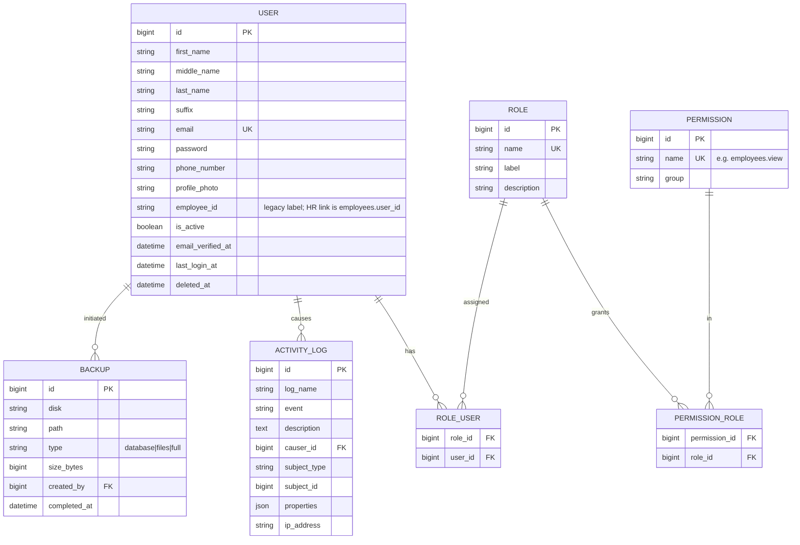

---

## 2. Organization & Company Setup

The configuration layer most modules read from.

```mermaid
erDiagram
    DEPARTMENT ||--o{ DEPARTMENT : parent_of
    DEPARTMENT ||--o{ POSITION : defines
    DEPARTMENT ||--o{ EMPLOYEE : employs
    WORK_SCHEDULE ||--o{ EMPLOYEE : assigned

    COMPANY_PROFILE {
        bigint id PK
        string name
        string legal_name
        string logo
        string email
        string phone
        text address
        string tin
        string sss_employer_no
        string philhealth_employer_no
        string pagibig_employer_no
    }
    DEPARTMENT {
        bigint id PK
        string name
        string code "unique per tenant"
        bigint parent_id FK "self"
        bigint head_id FK "employees"
        text description
        datetime deleted_at
    }
    POSITION {
        bigint id PK
        string title
        bigint department_id FK
        decimal salary_grade_min
        decimal salary_grade_max
        text description
    }
    WORK_SCHEDULE {
        bigint id PK
        string name
        time start_time
        time end_time
        json work_days "Mon..Sun"
        int grace_minutes
        decimal required_hours
    }
    HOLIDAY {
        bigint id PK
        string name
        date date
        enum type "regular|special_non_working|special_working"
        boolean is_recurring
    }
    LEAVE_TYPE {
        bigint id PK
        string name
        boolean is_paid
        decimal default_days
        boolean carries_over
    }
    AWARD_TYPE {
        bigint id PK
        string name
        text description
    }
    KPI_CRITERION {
        bigint id PK
        string name
        text description
        decimal weight
        boolean is_active
    }
    EVALUATION_PERIOD {
        bigint id PK
        string name
        date start_date
        date end_date
        enum status "draft|open|closed"
    }
    ALLOWANCE_TYPE {
        bigint id PK
        string name
        boolean is_taxable
    }
    DEDUCTION_TYPE {
        bigint id PK
        string name
        enum kind "sss|philhealth|pagibig|withholding_tax|loan|other"
        boolean is_mandatory
        json computation "table/rate config"
    }
    EMAIL_TEMPLATE {
        bigint id PK
        string key UK
        string subject
        text body
        boolean is_enabled
    }
```

> `COMPANY_PROFILE`, `HOLIDAY`, `LEAVE_TYPE`, `AWARD_TYPE`, `KPI_CRITERION`,
> `EVALUATION_PERIOD`, `ALLOWANCE_TYPE`, `DEDUCTION_TYPE`, `EMAIL_TEMPLATE` are
> standalone config tables referenced by the operational modules below.
>
> **Built:** `LEAVE_TYPE`, `KPI_CRITERION` +
> `EVALUATION_PERIOD` (managed at `/setup/kpi` — see
> [Performance](../modules/performance.md)), and `AWARD_TYPE` (managed at
> `/setup/award-types` — see [Awards](../modules/awards.md)).
> **`ALLOWANCE_TYPE` / `DEDUCTION_TYPE` were removed** with Payroll — see
> [ADR 0019](../decisions/0019-remove-payroll-and-benefits.md).
>
> **`COMPANY_PROFILE` is the `organizations` row itself** — not a separate table. Its
> fields (`legal_name`, `logo`, `email`, `phone`, `address`, `tin`, `*_employer_no`) live
> on `organizations` and are edited at `/setup/company` (ADR 0005 — the tenant doubles as
> the company profile). See [Company Profile](../modules/company-profile.md).
>
> **Built:** `WORK_SCHEDULE` + `HOLIDAY` (managed together at `/setup/schedule`; `holidays`
> is new, `work_schedules` gained soft deletes + a management UI, and a non-working holiday
> is no longer charged as a leave day) — see
> [Work Schedule & Holidays](../modules/work-schedule-holidays.md).

---

## 3. Employee Core (the hub)

Almost everything references `EMPLOYEE`.

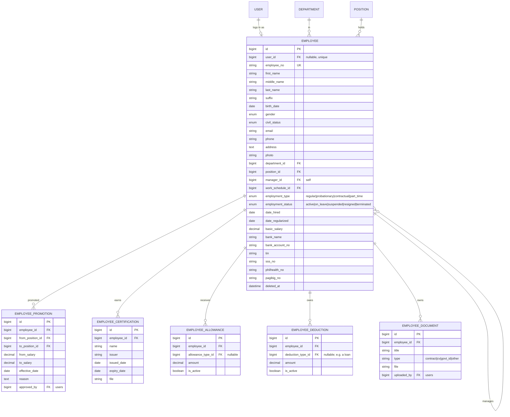

---

## 4. Recruitment & Onboarding (Talent Acquisition)

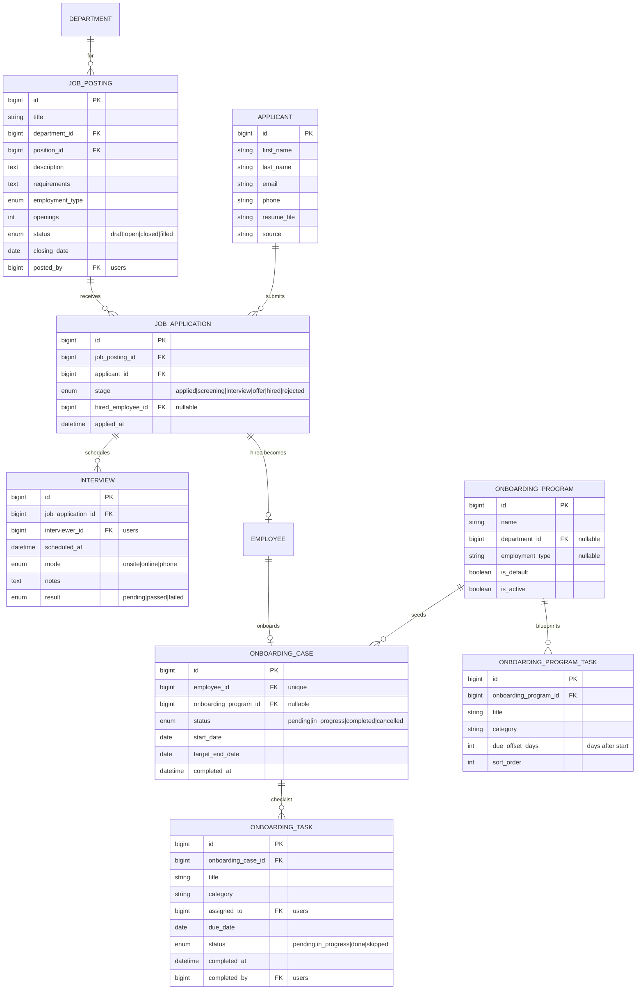

---

## 5. Time & Attendance

DTR app + bulk-import fallback. Source of overtime/lateness features for ML.

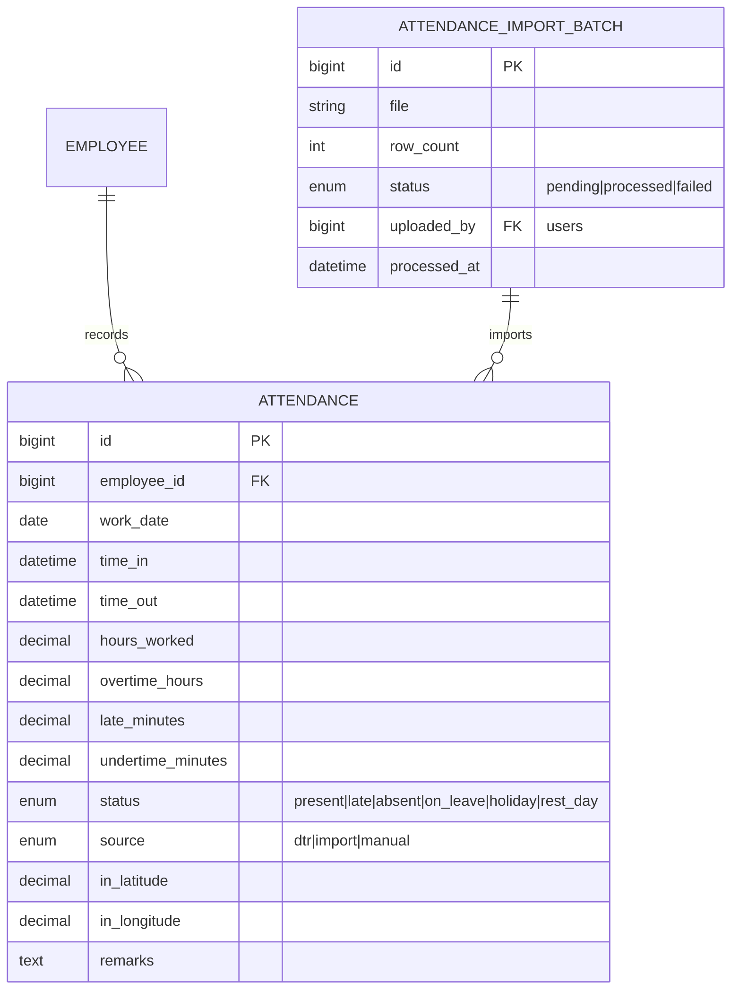

---

## 6. Leave Management

**Built** — leave types live in Company Setup; requests + balances in the Workforce
module. **Balances store only the entitlement**; used / pending / remaining are *derived*
from requests (never stored), so they cannot drift. See
[Leave](../modules/leave.md), [leave tables](../database/leave-tables.md) and
[ADR 0009](../decisions/0009-leave-management.md).

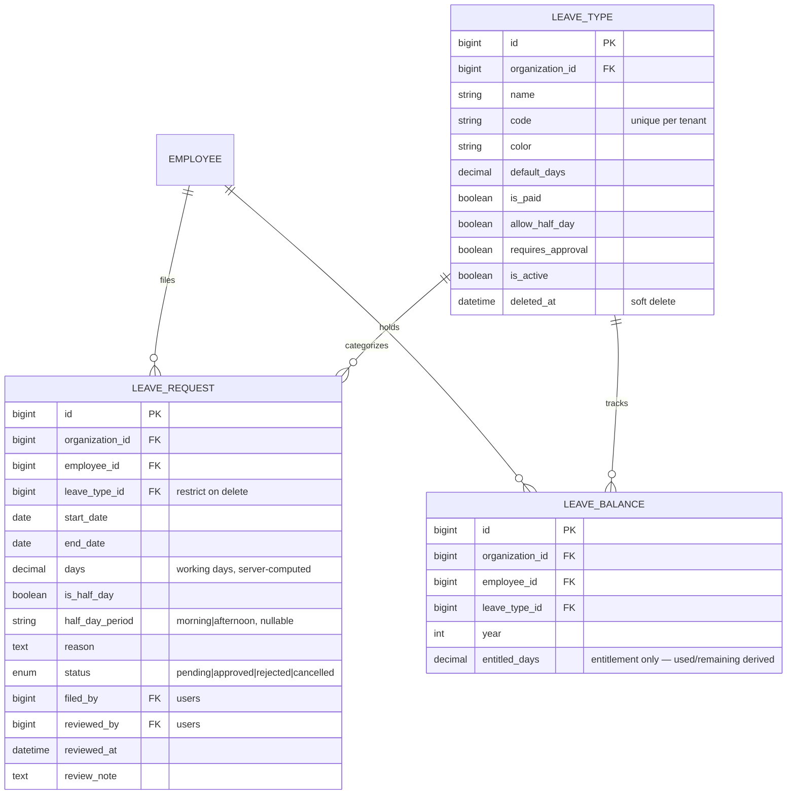

---

## 7. Payroll & Benefits

> **Removed (2026-06-27).** The Payroll and Benefits modules were taken out as out of
> scope for HR management — see [ADR 0019](../decisions/0019-remove-payroll-and-benefits.md).
> All of `payroll_periods`, `payslips`, `payslip_earnings`, `payslip_deductions`,
> `allowance_types`, `deduction_types`, `employee_allowances`, `employee_deductions`,
> `benefit_plans`, `benefit_enrollments` and `benefit_contributions` and their code/UI
> are gone. The employee's own compensation fields (`employees.basic_salary`, bank
> details, government-ID numbers) **stay** on the employee record (§3) as HR master data
> and feed the ML `salary` feature. The original proposed shape is kept below for
> reference only.

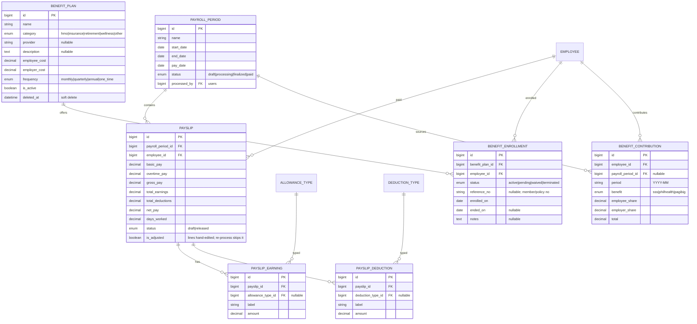

---

## 8. Performance & Training

Primary ML feature sources (KPI scores, training participation).

**Built (Performance)** — `kpi_criteria` + `evaluation_periods` (Company-Setup config,
ERD §2) and `performance_evaluations` + `performance_scores`. Evaluations score an
employee against the weighted criteria within a period; the **`overall_score` is
derived** (weighted average, `App\Support\Performance\PerformanceScorer`) through a
`draft → submitted → acknowledged` lifecycle, and each score line **snapshots** the
criterion's label + weight so archiving a criterion never alters a past appraisal
(added `acknowledged_at`). See [Performance](../modules/performance.md),
[performance tables](../database/performance-tables.md) and
[ADR 0012](../decisions/0012-performance-management.md).

**Built (Training)** — `training_programs` + `training_enrollments`. Programs are
created in-module (no Company-Setup config); a program's lifecycle status
(`upcoming → ongoing → completed`) is **derived from its date window**, not stored, and
enrollments carry a status, a completion score and a server-managed `completed_at`
(`end_date` / `capacity` are nullable for open-ended / uncapped programs; added
`remarks`). See [Training](../modules/training.md),
[training tables](../database/training-tables.md) and
[ADR 0013](../decisions/0013-training-and-development.md).

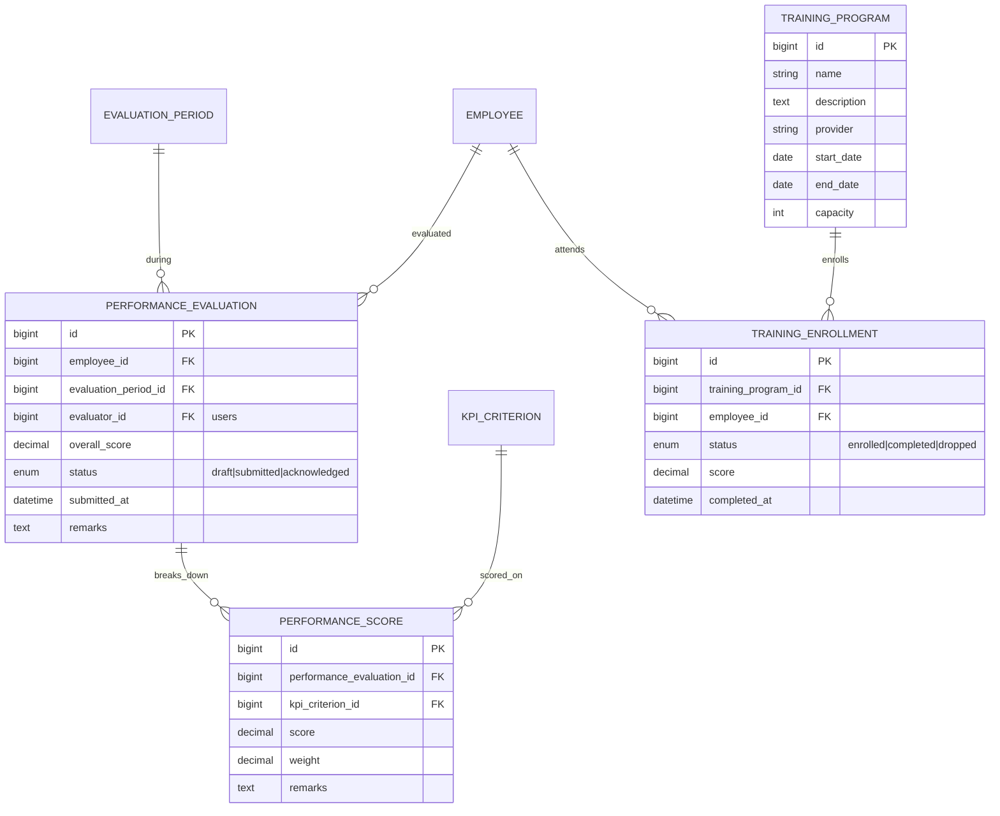

---

## 9. Awards, Events & Offboarding

**Built (Awards)** — `award_types` (Company-Setup catalogue, ERD §2; added a `color`
+ `is_active`) and `employee_awards`. Recognitions are a flat feed at `/awards`; an
award's type relation is loaded `withTrashed` so archived types still render on past
awards. See [Awards](../modules/awards.md),
[awards tables](../database/awards-tables.md) and
[ADR 0014](../decisions/0014-awards-and-recognition.md).

**Built (Events)** — `events` + `event_attendees`. Events are created in-module (no
Company-Setup config); an event's lifecycle status (`upcoming → ongoing → past`) is
**derived from its date-time window**, not stored, and inviting an employee with a
linked account notifies them and stamps `notified_at` (added soft-deletes; `ends_at`
is nullable for a point-in-time entry). See [Events](../modules/events.md),
[events tables](../database/events-tables.md) and
[ADR 0015](../decisions/0015-events-and-meetings.md).

**Built (Offboarding)** — `offboarding_cases` + `clearance_items`. Mirrors Onboarding
(a per-employee case + a checklist), but the checklist is a **clearance grouped by
responsible department** and the case-level `clearance_status` is **derived** from the
items (`pending → in_progress → cleared`), not stored. A deliberate lifecycle
(`initiated → clearance → completed`, plus `cancelled`); completing the exit
**transitions the employee's `employment_status`** (added `completed_at`; `remarks` +
`sort_order` on items). See [Offboarding](../modules/offboarding.md),
[offboarding tables](../database/offboarding-tables.md) and
[ADR 0016](../decisions/0016-offboarding-and-clearance.md).

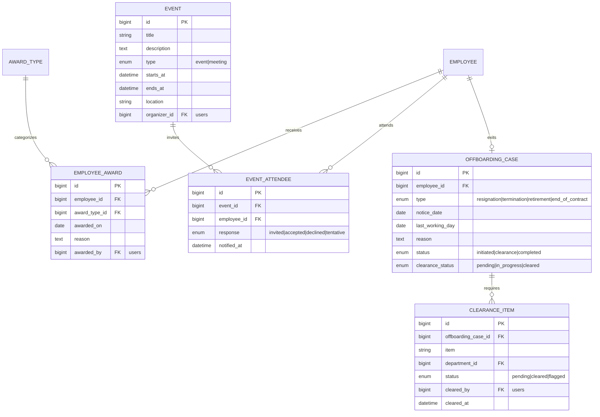

---

## 10. Analytics & AI — ML inference outputs

Written by the FastAPI ML service, read by the dashboard. Each row is one
prediction snapshot (kept historically so trends can be charted).

**Built (Promotion Readiness)** — a standalone **FastAPI inference service**
(`model/api`) the Laravel app calls server-side (`App\Support\Ml\MlClient`), plus
`promotion_readiness_runs` + `promotion_readiness_scores` (a header-plus-lines
batch). Scores are model-derived, never entered; the service is optional (graceful
degradation when offline). See [Promotion Readiness](../modules/promotion-readiness.md)
and [ADR 0017](../decisions/0017-predictive-analytics-and-ml-inference.md).

**Built (Performance Forecast)** — `performance_forecast_runs` +
`performance_forecasts`, the second surface on the same service. Maps the ERD's
`predicted_rating` / `confidence` / `features` / `target_period_id` onto the proven
header-plus-lines shape (recording the model as a `model_version` string in place of
`ml_model_id`, as Promotion Readiness does). The regressor's lack of factor
contributions is covered by a Laravel-derived **band** + **confidence** (data
coverage) and a **rating trajectory**. See
[Performance Forecast](../modules/performance-forecast.md) and
[ADR 0018](../decisions/0018-performance-forecasting.md).

**Built (Attrition Risk)** — `attrition_risk_runs` + `attrition_risk_scores`, the
third surface on the same service. Maps the ERD's `ATTRITION_PREDICTION`
(`risk_score` → `probability`/`score`, `risk_level` → `tier`, `features`) onto the
proven header-plus-lines shape (model recorded as a `model_version` string). Two
intended deviations: the model is a **Random Forest** that exposes no per-instance
contributions, so the ERD's `factors` is **dropped** in favour of a Laravel-derived
**confidence** (data coverage) + the grounded feature snapshot — matching the
Performance Forecast precedent; and it is trained on only the **ERP-servable** subset
of columns so its inputs match what the HR system can supply at inference. See
[Attrition Risk](../modules/attrition-risk.md) and
[ADR 0021](../decisions/0021-attrition-risk.md).

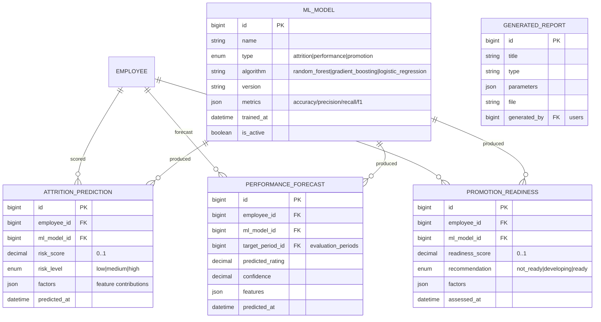

---

## 11. Assistant — LLM conversations & document processing

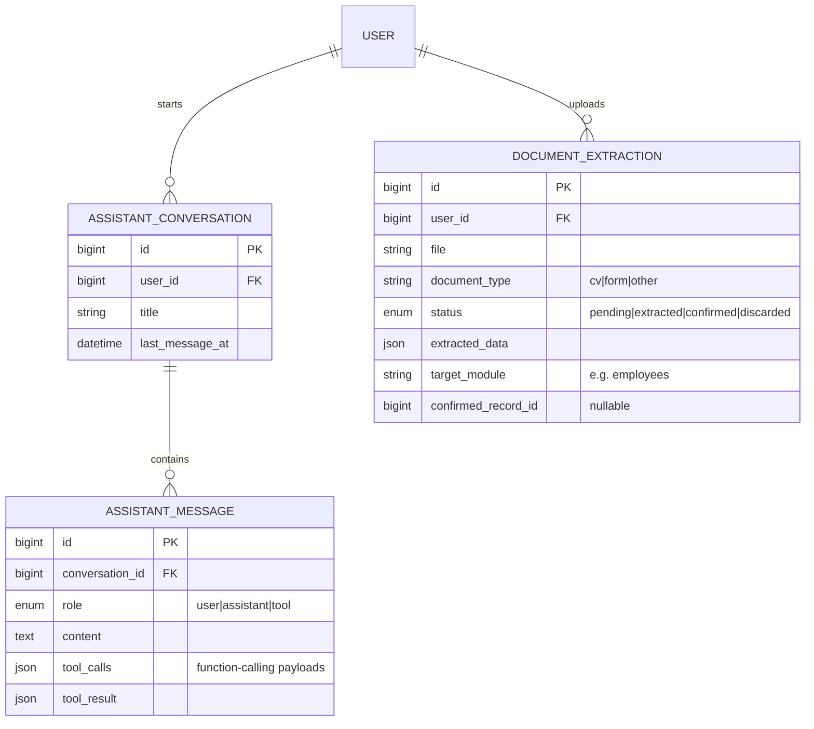

> The LLM **function-calling layer does not get its own action tables** — it invokes
> the existing module controllers/actions (create employee, file leave, etc.) and
> those writes are captured in `activity_logs` like any other action. Conversations
> and document extractions are the only LLM-specific persistence.

---

## Central relationships at a glance

- **`EMPLOYEE`** is the hub: Department, Position, Manager (self), Work Schedule →
  and is referenced by Attendance, Leave, Payslip, Performance, Training, Awards,
  Events, Offboarding, Promotions, Certifications, and all three ML output tables.
- **`USER`** is the actor: it owns auth, roles/permissions, audit (`activity_logs`),
  assistant conversations, and is the FK for every `*_by` / approver / evaluator
  column. Linked 1:1 (optional) to an Employee.
- **Company Setup** tables are the lookups every operational module depends on.

---

## Build order implied by this ERD

1. **System**: User Management ✓, Activity Logs ✓ → **Roles & Permissions** (next in System).
2. **Foundation**: Company Profile, **Departments**, Positions, Work Schedules → **Employees** (+ the User↔Employee link).
3. **Operational** (generate ML features): **Leave ✓** (see [Leave](../modules/leave.md)), **Attendance/DTR ✓**, ~~Payroll~~ / ~~Benefits~~ (removed — [ADR 0019](../decisions/0019-remove-payroll-and-benefits.md)), **Performance ✓** (see [Performance](../modules/performance.md)), **Training ✓** (see [Training](../modules/training.md)), **Awards ✓** (see [Awards](../modules/awards.md)), **Events ✓** (see [Events](../modules/events.md)).
4. **Talent**: Recruitment ✓, Onboarding ✓, **Offboarding ✓** (see [Offboarding](../modules/offboarding.md)).
5. **Company Setup**: Departments & positions ✓ (org structure — see [Departments](../modules/departments.md)), **Leave Types ✓**; the rest of the config layer follows.
6. **Intelligence**: FastAPI ML service → prediction tables → Analytics dashboard.
7. **Assistant**: LLM conversations, function-calling, document processor.

---

## Open questions for your review

1. ~~**Employee ↔ User**~~ — **Resolved: separate**, linked 1:1 (optional) — see
   [ADR 0004](../decisions/0004-employee-user-separation.md).
2. ~~**Single-tenant** vs. multi-organization~~ — **Resolved: multi-tenant**, single
   database with row-level `organization_id` scoping — see
   [ADR 0005](../decisions/0005-multi-tenancy.md).
3. **`employees.employee_no`** is the canonical HR id; the existing
   `users.employee_id` string column becomes redundant — drop it once Employees exist?
4. **Approvers/evaluators as `users`** (current convention) vs. as `employees` — OK?
5. ~~**Benefit contributions**: standalone table vs. derived from payslip
   deductions~~ — **Resolved:** kept **`benefit_contributions`** but generated it
   from the run's statutory deductions (adding the **employer** share the payslips
   lack), and added **`benefit_plans` + `benefit_enrollments`** for benefit-program
   administration — see [ADR 0011](../decisions/0011-benefits-administration.md).
6. ~~**Recruitment applicants** are *not* users/employees until hired~~ — **Resolved:
   standalone `applicants` table** (a reusable candidate pool); a hire creates an
   employee via the bridge — see [ADR 0006](../decisions/0006-recruitment-ats-and-hire-bridge.md).
