# STAFFA — Entity Relationship Diagram

> **Status: DRAFT for review.** This is the proposed data model for the whole
> system, derived from the capstone proposal and the application navigation. Built
> so far: `users`, `activity_logs`, the RBAC tables, `notifications`, and the
> **Employee core** + organisation lookups (`departments`, `positions`,
> `work_schedules`, `employees` + sub-records — see
> [Employees](../modules/employees.md) and [ADR 0004](../decisions/0004-employee-user-separation.md)).
> Review the **Design decisions** and **Open questions** sections first — a few
> choices shape everything downstream.

---

## Conventions

- **Tables**: `snake_case`, plural. **Diagrams** below use `UPPER_SNAKE`, singular.
- **PK**: `id` (bigint). **FK**: `<singular>_id`.
- **Timestamps**: every table has `created_at` / `updated_at`.
- **Soft deletes**: `deleted_at` on archivable business records (employees, most
  operational records) — never hard-delete HR data by default.
- **Money**: `decimal(12,2)`. **Flexible/derived data**: `json`.
- **Enums** shown as `enum(...)` are stored as short strings.

### Actor vs. Subject FK convention

- **Actor columns** — *who performed an action* (`*_by`, `approver_id`,
  `evaluator_id`, `interviewer_id`, `organizer_id`) → reference **`users`** (you must
  be an authenticated account to act).
- **Subject / org-chart columns** — *the person being managed* (`employee_id`,
  `manager_id`, `head_id`) → reference **`employees`**.

---

## Design decisions (please confirm)

1. **Single-tenant deployment.** One organization per installation, so there is no
   `organization_id` scattered across tables; `company_profiles` is effectively a
   singleton. (If a multi-org SaaS is ever wanted, this is the expensive thing to
   retrofit — flag now if so.)
2. **`Employee` is separate from `User`.** `employees.user_id` is a **nullable,
   unique** FK to `users`. An Employee is the HR record (a DTR-only field worker may
   have no login); a User is an auth account (an IT admin may not be an employee).
   *This is the pivotal choice — see Open questions.*
3. **RBAC** uses `roles` + `permissions` + pivots (shape mirrors
   `spatie/laravel-permission` so we can adopt the package later without a schema
   change).
4. **ML inference is persisted.** The FastAPI service writes results into
   `attrition_predictions`, `performance_forecasts`, and
   `promotion_readiness_assessments`; the Analytics dashboard only *reads* them. The
   Laravel app never runs models inline.
5. **Company Setup tables are the configuration layer** (leave types, deduction
   types, KPI criteria, schedules, holidays, award types) that the operational
   modules reference — not hard-coded.

---

## 1. System & Access Control

Auth accounts, roles/permissions, audit trail, and backups.

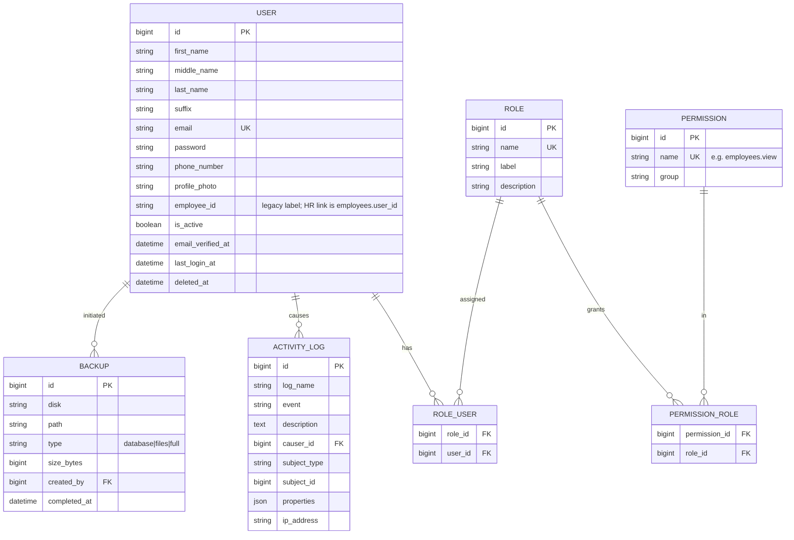

---

## 2. Organization & Company Setup

The configuration layer most modules read from.

```mermaid
erDiagram
    DEPARTMENT ||--o{ DEPARTMENT : parent_of
    DEPARTMENT ||--o{ POSITION : defines
    DEPARTMENT ||--o{ EMPLOYEE : employs
    WORK_SCHEDULE ||--o{ EMPLOYEE : assigned

    COMPANY_PROFILE {
        bigint id PK
        string name
        string legal_name
        string logo
        string email
        string phone
        text address
        string tin
        string sss_employer_no
        string philhealth_employer_no
        string pagibig_employer_no
    }
    DEPARTMENT {
        bigint id PK
        string name
        string code UK
        bigint parent_id FK "self"
        bigint head_id FK "employees"
        text description
        datetime deleted_at
    }
    POSITION {
        bigint id PK
        string title
        bigint department_id FK
        decimal salary_grade_min
        decimal salary_grade_max
        text description
    }
    WORK_SCHEDULE {
        bigint id PK
        string name
        time start_time
        time end_time
        json work_days "Mon..Sun"
        int grace_minutes
        decimal required_hours
    }
    HOLIDAY {
        bigint id PK
        string name
        date date
        enum type "regular|special_non_working|special_working"
        boolean is_recurring
    }
    LEAVE_TYPE {
        bigint id PK
        string name
        boolean is_paid
        decimal default_days
        boolean carries_over
    }
    AWARD_TYPE {
        bigint id PK
        string name
        text description
    }
    KPI_CRITERION {
        bigint id PK
        string name
        text description
        decimal weight
        boolean is_active
    }
    EVALUATION_PERIOD {
        bigint id PK
        string name
        date start_date
        date end_date
        enum status "draft|open|closed"
    }
    ALLOWANCE_TYPE {
        bigint id PK
        string name
        boolean is_taxable
    }
    DEDUCTION_TYPE {
        bigint id PK
        string name
        enum kind "sss|philhealth|pagibig|withholding_tax|loan|other"
        boolean is_mandatory
        json computation "table/rate config"
    }
    EMAIL_TEMPLATE {
        bigint id PK
        string key UK
        string subject
        text body
        boolean is_enabled
    }
```

> `COMPANY_PROFILE`, `HOLIDAY`, `LEAVE_TYPE`, `AWARD_TYPE`, `KPI_CRITERION`,
> `EVALUATION_PERIOD`, `ALLOWANCE_TYPE`, `DEDUCTION_TYPE`, `EMAIL_TEMPLATE` are
> standalone config tables referenced by the operational modules below.

---

## 3. Employee Core (the hub)

Almost everything references `EMPLOYEE`.

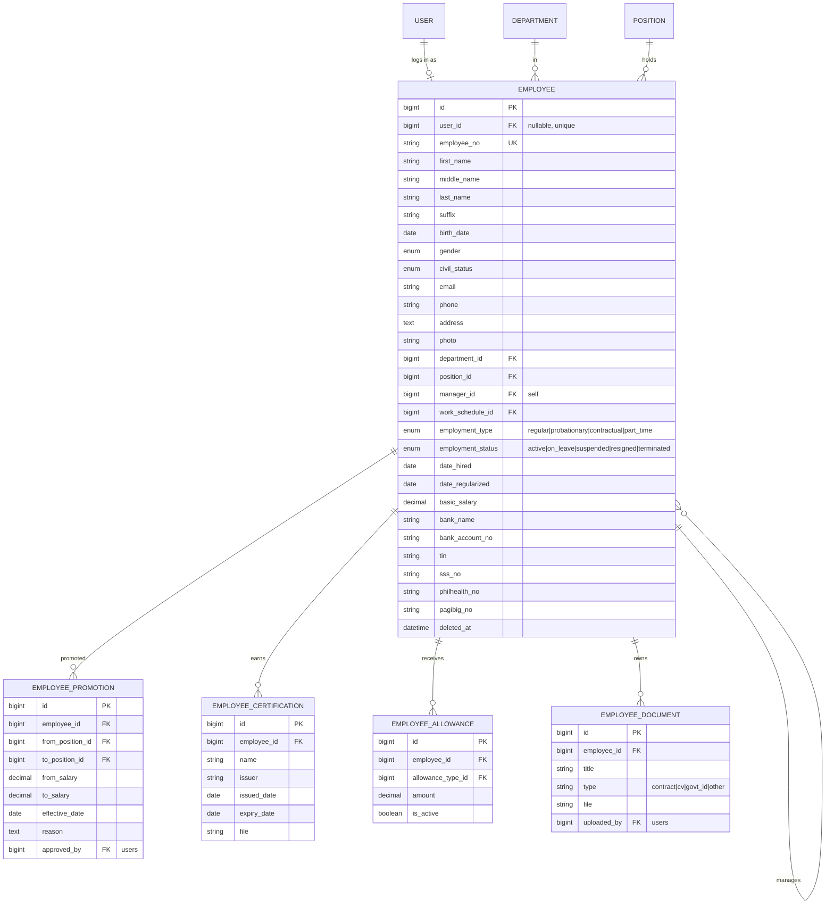

---

## 4. Recruitment & Onboarding (Talent Acquisition)

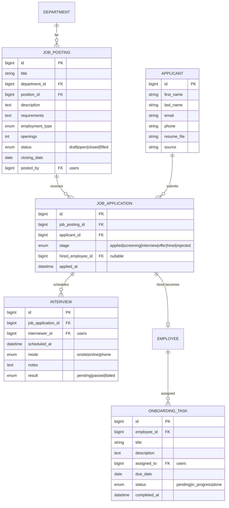

---

## 5. Time & Attendance

DTR app + bulk-import fallback. Source of overtime/lateness features for ML.

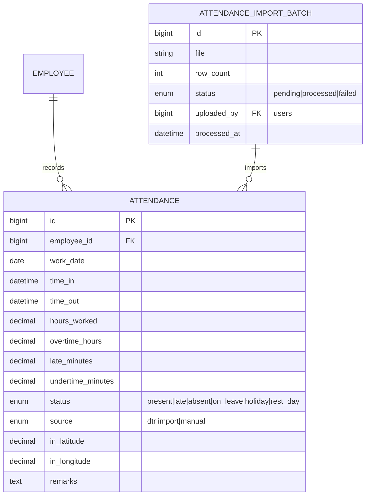

---

## 6. Leave Management

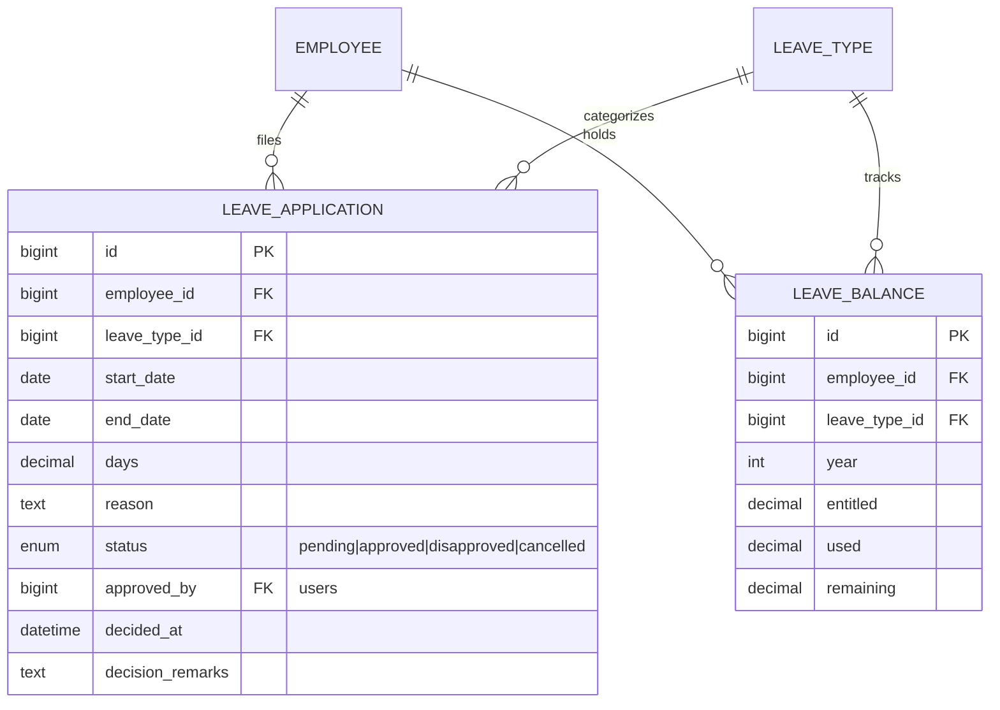

---

## 7. Payroll & Benefits

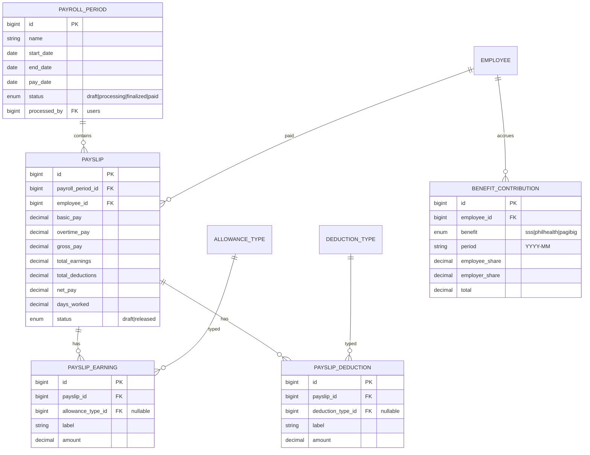

---

## 8. Performance & Training

Primary ML feature sources (KPI scores, training participation).

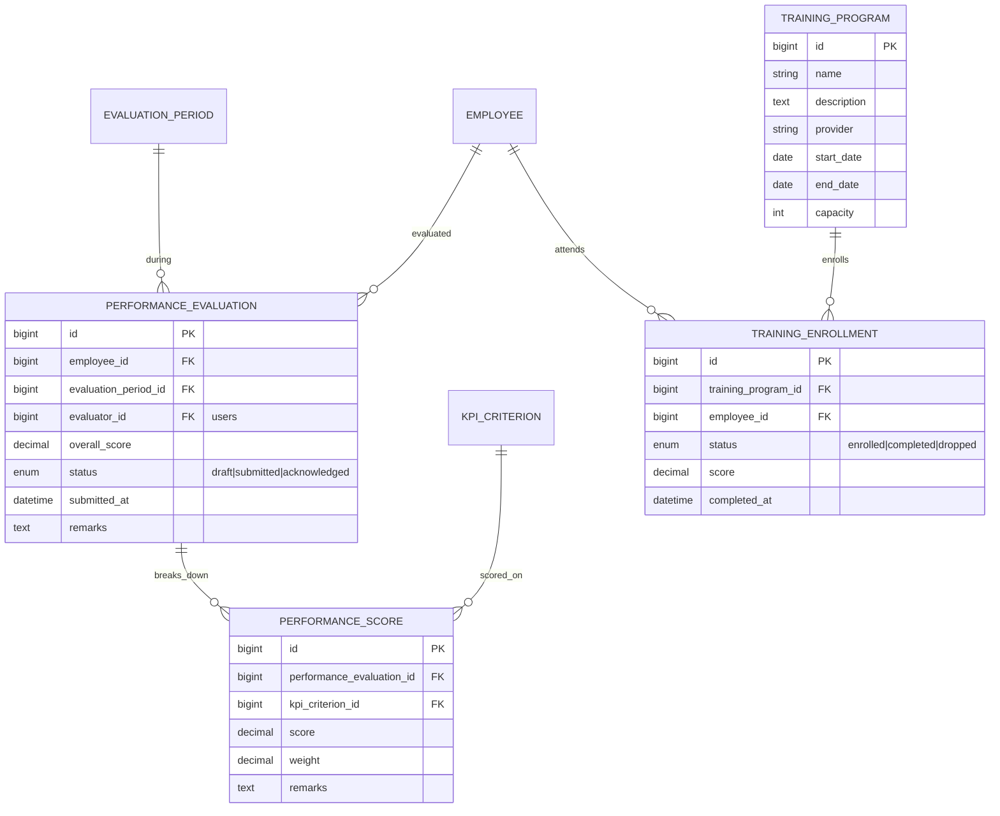

---

## 9. Awards, Events & Offboarding

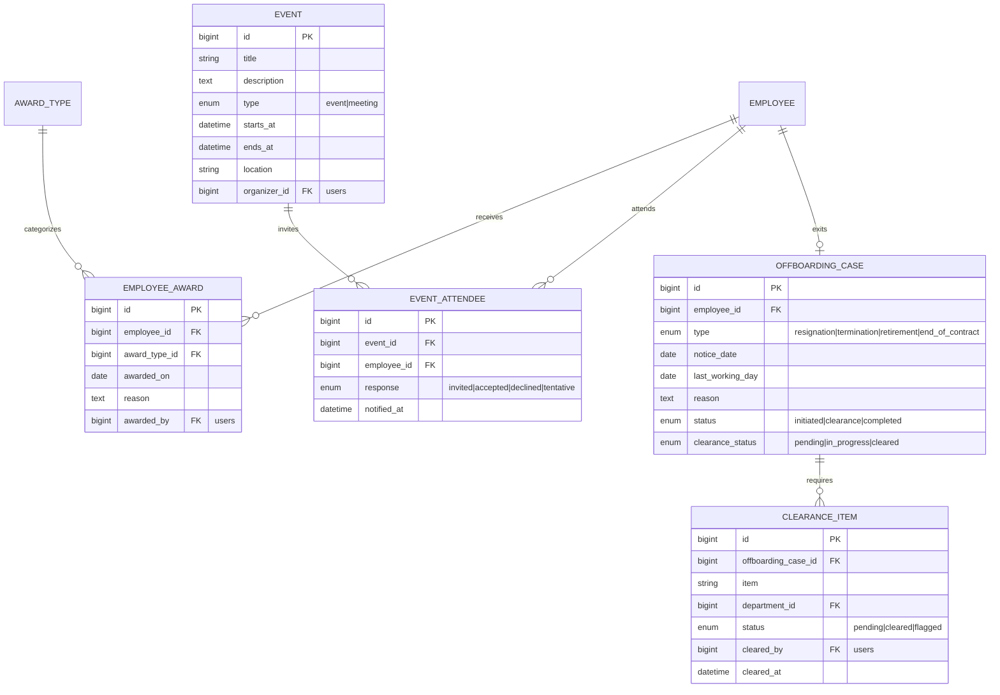

---

## 10. Analytics & AI — ML inference outputs

Written by the FastAPI ML service, read by the dashboard. Each row is one
prediction snapshot (kept historically so trends can be charted).

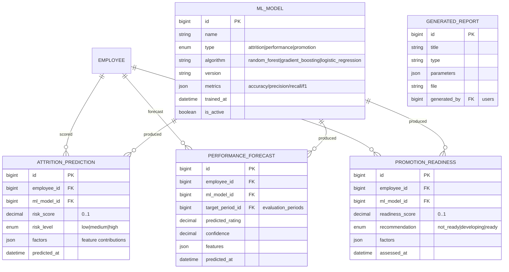

---

## 11. Assistant — LLM conversations & document processing

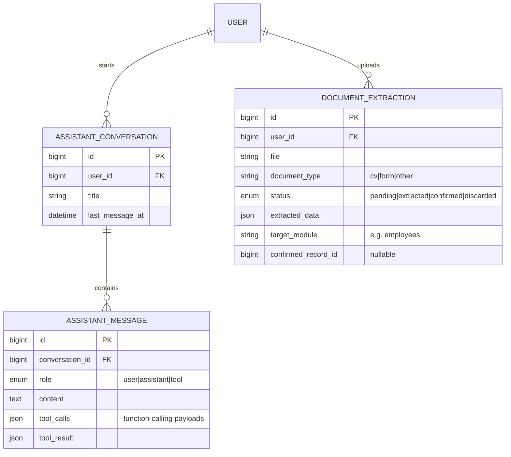

> The LLM **function-calling layer does not get its own action tables** — it invokes
> the existing module controllers/actions (create employee, file leave, etc.) and
> those writes are captured in `activity_logs` like any other action. Conversations
> and document extractions are the only LLM-specific persistence.

---

## Central relationships at a glance

- **`EMPLOYEE`** is the hub: Department, Position, Manager (self), Work Schedule →
  and is referenced by Attendance, Leave, Payslip, Performance, Training, Awards,
  Events, Offboarding, Promotions, Certifications, and all three ML output tables.
- **`USER`** is the actor: it owns auth, roles/permissions, audit (`activity_logs`),
  assistant conversations, and is the FK for every `*_by` / approver / evaluator
  column. Linked 1:1 (optional) to an Employee.
- **Company Setup** tables are the lookups every operational module depends on.

---

## Build order implied by this ERD

1. **System**: User Management ✓, Activity Logs ✓ → **Roles & Permissions** (next in System).
2. **Foundation**: Company Profile, **Departments**, Positions, Work Schedules → **Employees** (+ the User↔Employee link).
3. **Operational** (generate ML features): Attendance/DTR, Leave, Performance, Training, Payroll, Benefits, Awards, Events.
4. **Talent**: Recruitment, Onboarding; **Offboarding**.
5. **Intelligence**: FastAPI ML service → prediction tables → Analytics dashboard.
6. **Assistant**: LLM conversations, function-calling, document processor.

---

## Open questions for your review

1. **Employee ↔ User** — confirm the **separate** model (recommended) vs. collapsing
   Employee into User. Everything downstream depends on this.
2. **Single-tenant** vs. multi-organization — confirm single (recommended for the
   capstone scope).
3. **`employees.employee_no`** is the canonical HR id; the existing
   `users.employee_id` string column becomes redundant — drop it once Employees exist?
4. **Approvers/evaluators as `users`** (current convention) vs. as `employees` — OK?
5. **Benefit contributions**: standalone table (as drawn) vs. derived purely from
   payslip deductions — which do you prefer for reporting?
6. **Recruitment applicants** are *not* users/employees until hired — confirm a
   standalone `applicants` table is fine.
