# SYNAPSE — Entity Relationship Diagram

> **Status: built.** This is the data model the application runs on, drawn from the
> schema the migrations produce (every migration up to
> `2026_09_29_000000_add_product_tour_to_users`, introspected on 2026-10-01). It
> replaces the draft that was proposed before the modules were built. The draft's
> entities that were never built, or were built and later removed, are listed in
> [What the draft proposed](#what-the-draft-proposed) at the end.
>
> Each table also has a schema reference with its constraints and the reasoning behind
> them; the per-domain docs are linked in every section. When this file and a table
> doc disagree, the migrations are right. To re-check, migrate a scratch database and
> read `information_schema` (see [Keeping this current](#keeping-this-current)).

---

## Conventions

- **Tables** are `snake_case`, plural. **Diagrams** use `UPPER_SNAKE`, singular.
- **PK** is `id` (bigint), except `notifications.id` (uuid) and the two RBAC pivots,
  which have no id. **FK** is `<singular>_id`.
- **Tenant column.** Every tenant-owned table carries a non-null `organization_id` →
  `organizations`, indexed, cascade on delete
  ([ADR 0005](../decisions/0005-multi-tenancy.md)). It is **left out of the diagrams**
  so they stay readable. The exceptions are listed in [§1](#1-identity-access--tenancy).
- **Timestamps.** Every table has `created_at` / `updated_at` (left out of the
  diagrams). `deleted_at` is shown where a table soft-deletes.
- **Enums** are short strings constrained in the app (a model constant or a form
  request), not database enum types. Their values are shown in quotes.
- **Money** is `decimal(12,2)`. Flexible or derived data is `json`.

### Actor vs. subject

- **Actor columns** say who did something (`*_by`, `evaluator_id`, `interviewer_id`,
  `organizer_id`, `causer_id`, `assigned_to`) and reference **`users`**. All of them
  are nullable and set to null when the account is deleted.
- **Subject columns** say who is being managed (`employee_id`, `manager_id`,
  `head_id`, `hired_employee_id`) and reference **`employees`**.

### Delete behaviour

A child of a record (an item of a checklist, a line of a run, a stage of a pipeline)
**cascades** with it. A reference to configuration or to a person who acted is **set
to null**, so archiving a department or deleting an account never deletes history.
Three references **restrict** the delete instead, because deleting the parent would
leave the child meaningless: `leave_requests.leave_type_id`,
`job_postings.recruitment_pipeline_id` and `job_applications.recruitment_pipeline_stage_id`.

---

## Design decisions

1. **Multi-tenant, one database.** Every registration creates an `organizations` row,
   which is the tenant and also the company profile (there is no `company_profiles`
   table). Tenant tables are isolated by a global query scope
   ([ADR 0005](../decisions/0005-multi-tenancy.md),
   [Multi-tenancy](../modules/multi-tenancy.md)).
2. **A user is a global identity; employment is per organisation.** `users` has no
   tenant column. A person belongs to organisations through `organization_user`, and
   is an employee of each through one `employees` row, unique on
   `(organization_id, user_id)`
   ([ADR 0023](../decisions/0023-identity-and-organization-membership.md)). People
   register themselves and join with an invitation or the organisation's join code
   ([ADR 0026](../decisions/0026-self-served-identity-and-workspace-join.md)).
3. **`Employee` is separate from `User`.** `employees.user_id` is nullable: a field
   worker may have no login, and an administrator may not be an employee
   ([ADR 0004](../decisions/0004-employee-user-separation.md)).
4. **RBAC is per organisation.** `roles` carry a tenant column (role names are unique
   per organisation); `permissions` are a global catalogue defined in code
   ([ADR 0002](../decisions/0002-rbac-authorization.md)).
5. **Derive, don't store.** Leave used/remaining, a training program's or event's
   status, an offboarding case's clearance status and an attendance day's approval
   status are computed from other rows, so they cannot drift. Where a past result must
   not change when configuration changes, the row **snapshots** it instead (a
   scorecard's criteria and scale, an attendance day's rules).
6. **Predictions are persisted as runs.** Each predictive surface stores a run header
   and one line per employee. The Laravel app calls the inference service
   (`model/api`) and writes what it returns; the screens only read runs
   ([ADR 0017](../decisions/0017-predictive-analytics-and-ml-inference.md)).
   `local_models` records each organisation's own trained models
   ([ADR 0046](../decisions/0046-model-graduation-trains-on-the-organisations-own-records.md)).
7. **No payroll, no benefits.** Both modules were removed
   ([ADR 0019](../decisions/0019-remove-payroll-and-benefits.md)). The employee's
   compensation fields stay on `employees` as HR master data.

---

## 1. Identity, access & tenancy

Accounts, membership, sign-in, roles, the audit trail and notifications. See
[`organizations`](./organizations-table.md), [`users`](./users-table.md),
[identity & membership tables](./identity-and-membership-tables.md),
[RBAC tables](./roles-permissions-tables.md) and
[notifications tables](./notifications-tables.md).


```mermaid
erDiagram
    ORGANIZATION ||--o{ ORGANIZATION_USER : has
    USER ||--o{ ORGANIZATION_USER : "belongs via"
    ORGANIZATION ||--o{ ROLE : defines
    ROLE ||--o{ ROLE_USER : assigned
    USER ||--o{ ROLE_USER : holds
    ROLE ||--o{ PERMISSION_ROLE : grants
    PERMISSION ||--o{ PERMISSION_ROLE : "granted by"
    USER ||--o{ PASSKEY : registers
    USER ||--o{ PERSONAL_ACCESS_TOKEN : "signs in with"
    ORGANIZATION |o--o{ PERSONAL_ACCESS_TOKEN : "binds"
    EMPLOYEE ||--o{ EMPLOYEE_INVITATION : "invited as"
    USER |o--o{ EMPLOYEE_INVITATION : accepts
    ORGANIZATION ||--o{ ORGANIZATION_JOIN_REQUEST : receives
    USER ||--o{ ORGANIZATION_JOIN_REQUEST : asks
    USER |o--o{ ACTIVITY_LOG : causes
    USER ||--o{ NOTIFICATION : receives
    USER ||--o{ PUSH_SUBSCRIPTION : subscribes

    ORGANIZATION {
        bigint id PK
        string name
        string slug UK
        string join_code UK "nullable"
        boolean join_code_enabled
        string legal_name
        string logo
        string email
        string phone
        text address
        string tin
        string sss_employer_no
        string philhealth_employer_no
        string pagibig_employer_no
        string timezone "IANA, default Asia/Manila"
        bigint default_work_schedule_id FK
        datetime setup_completed_at "null = guided setup owed"
        json setup_steps
        date attendance_closed_from
        date attendance_closed_through
        datetime deleted_at
    }
    USER {
        bigint id PK
        string email UK
        string password "nullable"
        string first_name
        string middle_name
        string last_name
        string suffix
        string phone_number
        string profile_photo
        string employee_id UK "legacy label; the HR link is employees.user_id"
        boolean is_active
        boolean email_notifications
        boolean push_notifications
        datetime email_verified_at
        string email_verification_code "hashed"
        datetime email_verification_code_expires_at
        text two_factor_secret
        text two_factor_recovery_codes
        datetime two_factor_confirmed_at
        datetime last_login_at
        datetime password_changed_at
        datetime tour_finished_at "null = first-run tour owed"
        string tour_outcome "completed|skipped"
        string remember_token
        datetime deleted_at
    }
    ORGANIZATION_USER {
        bigint id PK
        bigint organization_id FK
        bigint user_id FK
        boolean is_default "the login landing workspace"
        datetime joined_at
    }
    ROLE {
        bigint id PK
        string name "unique per organisation"
        string label
        string description
        boolean is_system
    }
    PERMISSION {
        bigint id PK
        string name UK "e.g. employees.view"
        string label
        string group
    }
    ROLE_USER {
        bigint role_id FK
        bigint user_id FK
    }
    PERMISSION_ROLE {
        bigint permission_id FK
        bigint role_id FK
    }
    PASSKEY {
        bigint id PK
        bigint user_id FK
        string name
        string credential_id UK
        json credential
        datetime last_used_at
    }
    PERSONAL_ACCESS_TOKEN {
        bigint id PK
        string tokenable_type
        bigint tokenable_id
        bigint organization_id FK "nullable: the token's active workspace"
        text name
        string token UK
        text abilities
        datetime last_used_at
        datetime expires_at
    }
    EMPLOYEE_INVITATION {
        bigint id PK
        bigint employee_id FK
        string email
        string token UK "sha256 of the emailed link"
        string code UK "retypeable; unique globally"
        bigint invited_by FK
        datetime expires_at
        datetime accepted_at
        bigint accepted_by FK
        datetime revoked_at
    }
    ORGANIZATION_JOIN_REQUEST {
        bigint id PK
        bigint user_id FK
        bigint employee_id FK "set when HR approves"
        string status "pending|approved|declined"
        string decline_reason
        bigint reviewed_by FK
        datetime reviewed_at
    }
    ACTIVITY_LOG {
        bigint id PK
        bigint organization_id FK "nullable: system events"
        string log_name
        string event
        text description
        bigint causer_id FK
        string subject_type
        bigint subject_id
        string subject_label
        json properties
        string ip_address
        text user_agent
    }
    NOTIFICATION {
        uuid id PK
        string type
        string notifiable_type
        bigint notifiable_id
        text data "json payload"
        datetime read_at
    }
    PUSH_SUBSCRIPTION {
        bigint id PK
        string subscribable_type
        bigint subscribable_id
        string endpoint UK
        string public_key
        string auth_token
        string content_encoding
    }
```

> **Not tenant-stamped:** `users`, `permissions`, `role_user`, `permission_role`,
> `passkeys`, `notifications` and `push_subscriptions` (global, or reached only
> through a scoped side). `personal_access_tokens.organization_id` and
> `activity_logs.organization_id` are **nullable**. `organization_user` is the
> membership pivot itself, read through `User::memberships()`.
> `employee_invitations` and `organization_join_requests` are tenant-scoped models,
> but redeeming one deliberately bypasses the scope (`withoutGlobalScopes()`),
> because it happens before any tenant is bound.
>
> `users.employee_id` is a free-text label kept from before the Employees module. It
> is still editable on the account, but nothing links through it.

---

## 2. Company Setup

The configuration layer the operational modules read. Each screen lives under
`/setup/*` and is also a step of the setup wizard
([ADR 0044](../decisions/0044-the-setup-wizard-carries-every-company-setup-screen.md)).
The recruitment pipelines and the onboarding and offboarding programs are
configuration too; they are drawn with the modules that use them (§4, §5).

### 2a. Organisation structure, hours and places

See [employees & organisation tables](./employees-tables.md),
[work schedule & holiday tables](./work-schedule-holidays-tables.md),
[scheduling tables](./scheduling-tables.md) and
[attendance tables](./attendance-tables.md).

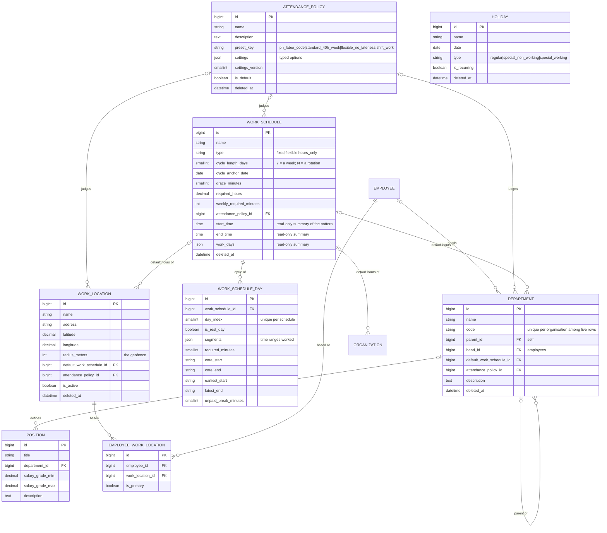
```mermaid
erDiagram
    DEPARTMENT |o--o{ DEPARTMENT : "parent of"
    DEPARTMENT |o--o{ POSITION : defines
    EMPLOYEE |o--o{ DEPARTMENT : heads
    WORK_SCHEDULE ||--o{ WORK_SCHEDULE_DAY : "cycle of"
    ATTENDANCE_POLICY |o--o{ WORK_SCHEDULE : judges
    ATTENDANCE_POLICY |o--o{ DEPARTMENT : judges
    ATTENDANCE_POLICY |o--o{ WORK_LOCATION : judges
    WORK_SCHEDULE |o--o{ DEPARTMENT : "default hours of"
    WORK_SCHEDULE |o--o{ WORK_LOCATION : "default hours of"
    WORK_SCHEDULE |o--o{ ORGANIZATION : "default hours of"
    WORK_LOCATION ||--o{ EMPLOYEE_WORK_LOCATION : bases
    EMPLOYEE ||--o{ EMPLOYEE_WORK_LOCATION : "based at"

    DEPARTMENT {
        bigint id PK
        string name
        string code "unique per organisation among live rows"
        bigint parent_id FK "self"
        bigint head_id FK "employees"
        bigint default_work_schedule_id FK
        bigint attendance_policy_id FK
        text description
        datetime deleted_at
    }
    POSITION {
        bigint id PK
        string title
        bigint department_id FK
        decimal salary_grade_min
        decimal salary_grade_max
        text description
    }
    WORK_SCHEDULE {
        bigint id PK
        string name
        string type "fixed|flexible|hours_only"
        smallint cycle_length_days "7 = a week; N = a rotation"
        date cycle_anchor_date
        smallint grace_minutes
        decimal required_hours
        int weekly_required_minutes
        bigint attendance_policy_id FK
        time start_time "read-only summary of the pattern"
        time end_time "read-only summary"
        json work_days "read-only summary"
        datetime deleted_at
    }
    WORK_SCHEDULE_DAY {
        bigint id PK
        bigint work_schedule_id FK
        smallint day_index "unique per schedule"
        boolean is_rest_day
        json segments "time ranges worked"
        smallint required_minutes
        string core_start
        string core_end
        string earliest_start
        string latest_end
        smallint unpaid_break_minutes
    }
    HOLIDAY {
        bigint id PK
        string name
        date date
        string type "regular|special_non_working|special_working"
        boolean is_recurring
        datetime deleted_at
    }
    ATTENDANCE_POLICY {
        bigint id PK
        string name
        text description
        string preset_key "ph_labor_code|standard_40h_week|flexible_no_lateness|shift_work"
        json settings "typed options"
        smallint settings_version
        boolean is_default
        datetime deleted_at
    }
    WORK_LOCATION {
        bigint id PK
        string name
        string address
        decimal latitude
        decimal longitude
        int radius_meters "the geofence"
        bigint default_work_schedule_id FK
        bigint attendance_policy_id FK
        boolean is_active
        datetime deleted_at
    }
    EMPLOYEE_WORK_LOCATION {
        bigint id PK
        bigint employee_id FK
        bigint work_location_id FK
        boolean is_primary
    }
```

> `employee_work_locations` is the one pivot without a tenant column: both sides are
> already scoped.

### 2b. Catalogues: leave, awards and the performance framework

See [leave tables](./leave-tables.md), [awards tables](./awards-tables.md) and
[performance tables](./performance-tables.md).

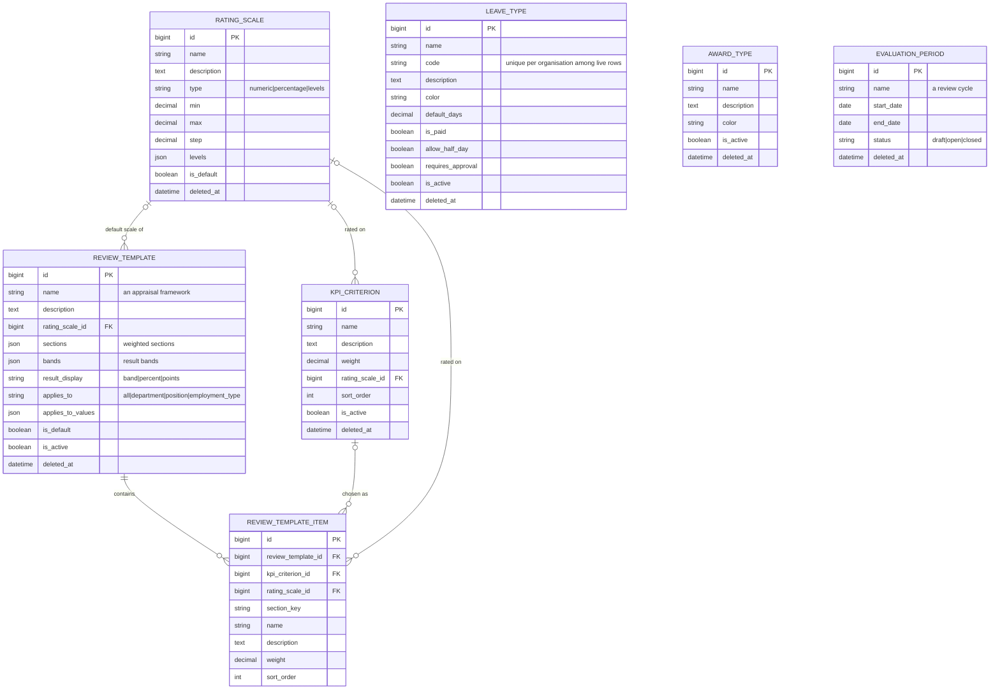
```mermaid
erDiagram
    RATING_SCALE |o--o{ KPI_CRITERION : "rated on"
    RATING_SCALE |o--o{ REVIEW_TEMPLATE : "default scale of"
    REVIEW_TEMPLATE ||--o{ REVIEW_TEMPLATE_ITEM : contains
    KPI_CRITERION |o--o{ REVIEW_TEMPLATE_ITEM : "chosen as"
    RATING_SCALE |o--o{ REVIEW_TEMPLATE_ITEM : "rated on"

    LEAVE_TYPE {
        bigint id PK
        string name
        string code "unique per organisation among live rows"
        text description
        string color
        decimal default_days
        boolean is_paid
        boolean allow_half_day
        boolean requires_approval
        boolean is_active
        datetime deleted_at
    }
    AWARD_TYPE {
        bigint id PK
        string name
        text description
        string color
        boolean is_active
        datetime deleted_at
    }
    RATING_SCALE {
        bigint id PK
        string name
        text description
        string type "numeric|percentage|levels"
        decimal min
        decimal max
        decimal step
        json levels
        boolean is_default
        datetime deleted_at
    }
    KPI_CRITERION {
        bigint id PK
        string name
        text description
        decimal weight
        bigint rating_scale_id FK
        int sort_order
        boolean is_active
        datetime deleted_at
    }
    REVIEW_TEMPLATE {
        bigint id PK
        string name "an appraisal framework"
        text description
        bigint rating_scale_id FK
        json sections "weighted sections"
        json bands "result bands"
        string result_display "band|percent|points"
        string applies_to "all|department|position|employment_type"
        json applies_to_values
        boolean is_default
        boolean is_active
        datetime deleted_at
    }
    REVIEW_TEMPLATE_ITEM {
        bigint id PK
        bigint review_template_id FK
        bigint kpi_criterion_id FK
        bigint rating_scale_id FK
        string section_key
        string name
        text description
        decimal weight
        int sort_order
    }
    EVALUATION_PERIOD {
        bigint id PK
        string name "a review cycle"
        date start_date
        date end_date
        string status "draft|open|closed"
        datetime deleted_at
    }
```

---

## 3. Employee core

Almost everything references `EMPLOYEE`. See
[employees & organisation tables](./employees-tables.md).

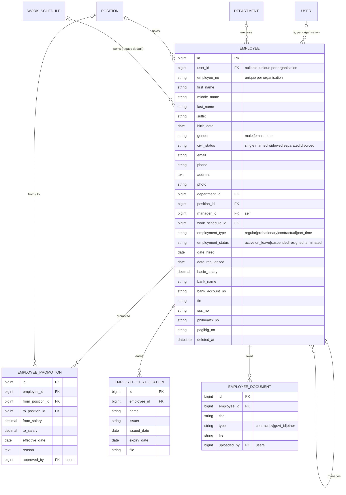
```mermaid
erDiagram
    USER |o--o{ EMPLOYEE : "is, per organisation"
    DEPARTMENT |o--o{ EMPLOYEE : employs
    POSITION |o--o{ EMPLOYEE : holds
    WORK_SCHEDULE |o--o{ EMPLOYEE : "works (legacy default)"
    EMPLOYEE |o--o{ EMPLOYEE : manages
    EMPLOYEE ||--o{ EMPLOYEE_PROMOTION : promoted
    POSITION |o--o{ EMPLOYEE_PROMOTION : "from / to"
    EMPLOYEE ||--o{ EMPLOYEE_CERTIFICATION : earns
    EMPLOYEE ||--o{ EMPLOYEE_DOCUMENT : owns

    EMPLOYEE {
        bigint id PK
        bigint user_id FK "nullable; unique per organisation"
        string employee_no "unique per organisation"
        string first_name
        string middle_name
        string last_name
        string suffix
        date birth_date
        string gender "male|female|other"
        string civil_status "single|married|widowed|separated|divorced"
        string email
        string phone
        text address
        string photo
        bigint department_id FK
        bigint position_id FK
        bigint manager_id FK "self"
        bigint work_schedule_id FK
        string employment_type "regular|probationary|contractual|part_time"
        string employment_status "active|on_leave|suspended|resigned|terminated"
        date date_hired
        date date_regularized
        decimal basic_salary
        string bank_name
        string bank_account_no
        string tin
        string sss_no
        string philhealth_no
        string pagibig_no
        datetime deleted_at
    }
    EMPLOYEE_PROMOTION {
        bigint id PK
        bigint employee_id FK
        bigint from_position_id FK
        bigint to_position_id FK
        decimal from_salary
        decimal to_salary
        date effective_date
        text reason
        bigint approved_by FK "users"
    }
    EMPLOYEE_CERTIFICATION {
        bigint id PK
        bigint employee_id FK
        string name
        string issuer
        date issued_date
        date expiry_date
        string file
    }
    EMPLOYEE_DOCUMENT {
        bigint id PK
        bigint employee_id FK
        string title
        string type "contract|cv|govt_id|other"
        string file
        bigint uploaded_by FK "users"
    }
```

> Which hours an employee works on a given day is no longer `employees.work_schedule_id`
> alone. A resolver picks, in order: a roster override, a dated assignment, the
> employee's work location, their department, then the organisation's default
> ([ADR 0037](../decisions/0037-schedules-are-templates-assignments-are-dated-a-resolver-decides-the-day.md)).
> See §6.

---

## 4. Recruitment

An applicant tracking system over configurable pipelines, with a hire → employee
bridge. See [recruitment tables](./recruitment-tables.md),
[ADR 0006](../decisions/0006-recruitment-ats-and-hire-bridge.md) and
[ADR 0029](../decisions/0029-configurable-recruitment-pipelines.md).

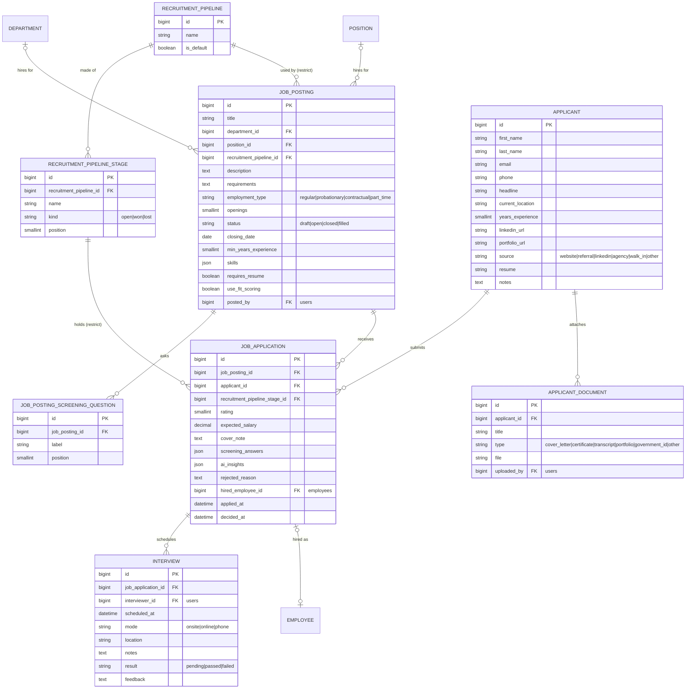
```mermaid
erDiagram
    RECRUITMENT_PIPELINE ||--o{ RECRUITMENT_PIPELINE_STAGE : "made of"
    RECRUITMENT_PIPELINE ||--o{ JOB_POSTING : "used by (restrict)"
    DEPARTMENT |o--o{ JOB_POSTING : "hires for"
    POSITION |o--o{ JOB_POSTING : "hires for"
    JOB_POSTING ||--o{ JOB_POSTING_SCREENING_QUESTION : asks
    JOB_POSTING ||--o{ JOB_APPLICATION : receives
    APPLICANT ||--o{ JOB_APPLICATION : submits
    APPLICANT ||--o{ APPLICANT_DOCUMENT : attaches
    RECRUITMENT_PIPELINE_STAGE ||--o{ JOB_APPLICATION : "holds (restrict)"
    JOB_APPLICATION ||--o{ INTERVIEW : schedules
    JOB_APPLICATION |o--o| EMPLOYEE : "hired as"

    RECRUITMENT_PIPELINE {
        bigint id PK
        string name
        boolean is_default
    }
    RECRUITMENT_PIPELINE_STAGE {
        bigint id PK
        bigint recruitment_pipeline_id FK
        string name
        string kind "open|won|lost"
        smallint position
    }
    JOB_POSTING {
        bigint id PK
        string title
        bigint department_id FK
        bigint position_id FK
        bigint recruitment_pipeline_id FK
        text description
        text requirements
        string employment_type "regular|probationary|contractual|part_time"
        smallint openings
        string status "draft|open|closed|filled"
        date closing_date
        smallint min_years_experience
        json skills
        boolean requires_resume
        boolean use_fit_scoring
        bigint posted_by FK "users"
    }
    JOB_POSTING_SCREENING_QUESTION {
        bigint id PK
        bigint job_posting_id FK
        string label
        smallint position
    }
    APPLICANT {
        bigint id PK
        string first_name
        string last_name
        string email
        string phone
        string headline
        string current_location
        smallint years_experience
        string linkedin_url
        string portfolio_url
        string source "website|referral|linkedin|agency|walk_in|other"
        string resume
        text notes
    }
    APPLICANT_DOCUMENT {
        bigint id PK
        bigint applicant_id FK
        string title
        string type "cover_letter|certificate|transcript|portfolio|government_id|other"
        string file
        bigint uploaded_by FK "users"
    }
    JOB_APPLICATION {
        bigint id PK
        bigint job_posting_id FK
        bigint applicant_id FK
        bigint recruitment_pipeline_stage_id FK
        smallint rating
        decimal expected_salary
        text cover_note
        json screening_answers
        json ai_insights
        text rejected_reason
        bigint hired_employee_id FK "employees"
        datetime applied_at
        datetime decided_at
    }
    INTERVIEW {
        bigint id PK
        bigint job_application_id FK
        bigint interviewer_id FK "users"
        datetime scheduled_at
        string mode "onsite|online|phone"
        string location
        text notes
        string result "pending|passed|failed"
        text feedback
    }
```

> `job_applications` is unique on `(job_posting_id, applicant_id)`: a candidate
> applies to a posting once. Hired or rejected is the **kind** of the stage the
> application sits in (`won` / `lost`), not a separate status column.

---

## 5. Onboarding & offboarding

Both modules pair a reusable **program** (Company Setup) with a per-employee **case**
and its checklist. Starting a case copies the best-matching active program's items
into it. See [onboarding tables](./onboarding-tables.md),
[offboarding tables](./offboarding-tables.md),
[ADR 0007](../decisions/0007-onboarding-template-bridge.md) and
[ADR 0016](../decisions/0016-offboarding-and-clearance.md).

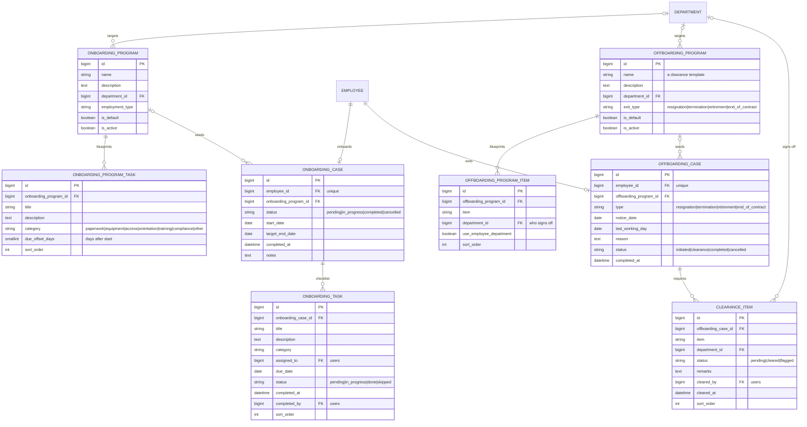
```mermaid
erDiagram
    DEPARTMENT |o--o{ ONBOARDING_PROGRAM : targets
    ONBOARDING_PROGRAM ||--o{ ONBOARDING_PROGRAM_TASK : blueprints
    ONBOARDING_PROGRAM |o--o{ ONBOARDING_CASE : seeds
    EMPLOYEE ||--o| ONBOARDING_CASE : onboards
    ONBOARDING_CASE ||--o{ ONBOARDING_TASK : checklist
    DEPARTMENT |o--o{ OFFBOARDING_PROGRAM : targets
    OFFBOARDING_PROGRAM ||--o{ OFFBOARDING_PROGRAM_ITEM : blueprints
    OFFBOARDING_PROGRAM |o--o{ OFFBOARDING_CASE : seeds
    EMPLOYEE ||--o| OFFBOARDING_CASE : exits
    OFFBOARDING_CASE ||--o{ CLEARANCE_ITEM : requires
    DEPARTMENT |o--o{ CLEARANCE_ITEM : "signs off"

    ONBOARDING_PROGRAM {
        bigint id PK
        string name
        text description
        bigint department_id FK
        string employment_type
        boolean is_default
        boolean is_active
    }
    ONBOARDING_PROGRAM_TASK {
        bigint id PK
        bigint onboarding_program_id FK
        string title
        text description
        string category "paperwork|equipment|access|orientation|training|compliance|other"
        smallint due_offset_days "days after start"
        int sort_order
    }
    ONBOARDING_CASE {
        bigint id PK
        bigint employee_id FK "unique"
        bigint onboarding_program_id FK
        string status "pending|in_progress|completed|cancelled"
        date start_date
        date target_end_date
        datetime completed_at
        text notes
    }
    ONBOARDING_TASK {
        bigint id PK
        bigint onboarding_case_id FK
        string title
        text description
        string category
        bigint assigned_to FK "users"
        date due_date
        string status "pending|in_progress|done|skipped"
        datetime completed_at
        bigint completed_by FK "users"
        int sort_order
    }
    OFFBOARDING_PROGRAM {
        bigint id PK
        string name "a clearance template"
        text description
        bigint department_id FK
        string exit_type "resignation|termination|retirement|end_of_contract"
        boolean is_default
        boolean is_active
    }
    OFFBOARDING_PROGRAM_ITEM {
        bigint id PK
        bigint offboarding_program_id FK
        string item
        bigint department_id FK "who signs off"
        boolean use_employee_department
        int sort_order
    }
    OFFBOARDING_CASE {
        bigint id PK
        bigint employee_id FK "unique"
        bigint offboarding_program_id FK
        string type "resignation|termination|retirement|end_of_contract"
        date notice_date
        date last_working_day
        text reason
        string status "initiated|clearance|completed|cancelled"
        datetime completed_at
    }
    CLEARANCE_ITEM {
        bigint id PK
        bigint offboarding_case_id FK
        string item
        bigint department_id FK
        string status "pending|cleared|flagged"
        text remarks
        bigint cleared_by FK "users"
        datetime cleared_at
        int sort_order
    }
```

> An offboarding case's **clearance status** is derived from its items, not stored.
> Completing an exit sets the employee's `employment_status`.

---

## 6. Time & attendance

Schedules are templates, assignments are dated, and a resolver decides each day's
shift. Punches are evidence; a daily record is the judged day, which snapshots the
rules it was judged by and closes itself at the end of the day. See
[scheduling tables](./scheduling-tables.md),
[attendance tables](./attendance-tables.md),
[ADR 0036](../decisions/0036-attendance-judged-in-local-time-on-shift-anchored-dates.md)
to [ADR 0042](../decisions/0042-no-attendance-requests-or-periods-the-roster-is-setup.md)
and [ADR 0054](../decisions/0054-no-kiosks-or-biometric-scanners.md).

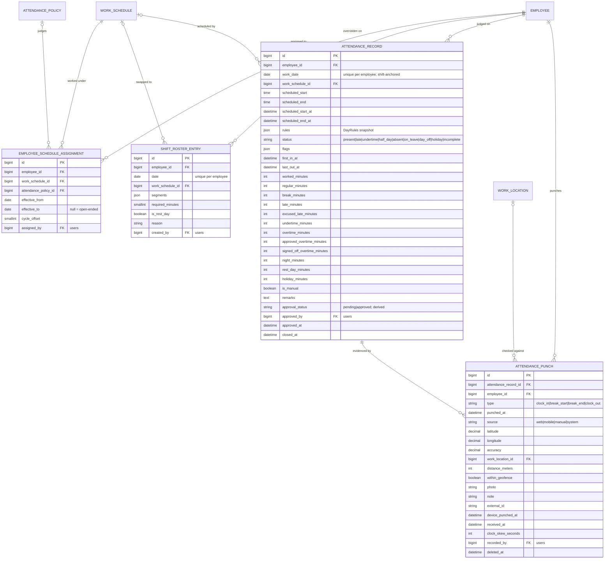
```mermaid
erDiagram
    EMPLOYEE ||--o{ EMPLOYEE_SCHEDULE_ASSIGNMENT : "assigned to"
    WORK_SCHEDULE ||--o{ EMPLOYEE_SCHEDULE_ASSIGNMENT : "worked under"
    ATTENDANCE_POLICY |o--o{ EMPLOYEE_SCHEDULE_ASSIGNMENT : judges
    EMPLOYEE ||--o{ SHIFT_ROSTER_ENTRY : "overridden on"
    WORK_SCHEDULE |o--o{ SHIFT_ROSTER_ENTRY : "swapped to"
    EMPLOYEE ||--o{ ATTENDANCE_RECORD : "judged on"
    WORK_SCHEDULE |o--o{ ATTENDANCE_RECORD : "scheduled by"
    ATTENDANCE_RECORD ||--o{ ATTENDANCE_PUNCH : "evidenced by"
    EMPLOYEE ||--o{ ATTENDANCE_PUNCH : punches
    WORK_LOCATION |o--o{ ATTENDANCE_PUNCH : "checked against"

    EMPLOYEE_SCHEDULE_ASSIGNMENT {
        bigint id PK
        bigint employee_id FK
        bigint work_schedule_id FK
        bigint attendance_policy_id FK
        date effective_from
        date effective_to "null = open-ended"
        smallint cycle_offset
        bigint assigned_by FK "users"
    }
    SHIFT_ROSTER_ENTRY {
        bigint id PK
        bigint employee_id FK
        date date "unique per employee"
        bigint work_schedule_id FK
        json segments
        smallint required_minutes
        boolean is_rest_day
        string reason
        bigint created_by FK "users"
    }
    ATTENDANCE_RECORD {
        bigint id PK
        bigint employee_id FK
        date work_date "unique per employee; shift-anchored"
        bigint work_schedule_id FK
        time scheduled_start
        time scheduled_end
        datetime scheduled_start_at
        datetime scheduled_end_at
        json rules "DayRules snapshot"
        string status "present|late|undertime|half_day|absent|on_leave|day_off|holiday|incomplete"
        json flags
        datetime first_in_at
        datetime last_out_at
        int worked_minutes
        int regular_minutes
        int break_minutes
        int late_minutes
        int excused_late_minutes
        int undertime_minutes
        int overtime_minutes
        int approved_overtime_minutes
        int signed_off_overtime_minutes
        int night_minutes
        int rest_day_minutes
        int holiday_minutes
        boolean is_manual
        text remarks
        string approval_status "pending|approved; derived"
        bigint approved_by FK "users"
        datetime approved_at
        datetime closed_at
    }
    ATTENDANCE_PUNCH {
        bigint id PK
        bigint attendance_record_id FK
        bigint employee_id FK
        string type "clock_in|break_start|break_end|clock_out"
        datetime punched_at
        string source "web|mobile|manual|system"
        decimal latitude
        decimal longitude
        decimal accuracy
        bigint work_location_id FK
        int distance_meters
        boolean within_geofence
        string photo
        string note
        string external_id
        datetime device_punched_at
        datetime received_at
        int clock_skew_seconds
        bigint recorded_by FK "users"
        datetime deleted_at
    }
```

---

## 7. Leave management

Balances store only the entitlement; used, pending and remaining are derived from
requests. A non-working holiday is not charged as a leave day. See
[leave tables](./leave-tables.md) and
[ADR 0009](../decisions/0009-leave-management.md).

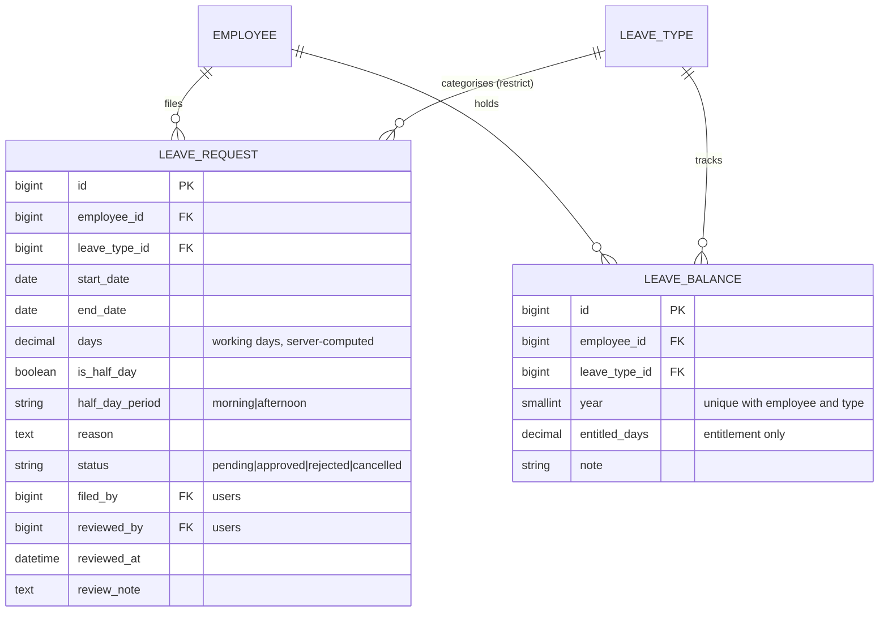
```mermaid
erDiagram
    EMPLOYEE ||--o{ LEAVE_REQUEST : files
    LEAVE_TYPE ||--o{ LEAVE_REQUEST : "categorises (restrict)"
    EMPLOYEE ||--o{ LEAVE_BALANCE : holds
    LEAVE_TYPE ||--o{ LEAVE_BALANCE : tracks

    LEAVE_REQUEST {
        bigint id PK
        bigint employee_id FK
        bigint leave_type_id FK
        date start_date
        date end_date
        decimal days "working days, server-computed"
        boolean is_half_day
        string half_day_period "morning|afternoon"
        text reason
        string status "pending|approved|rejected|cancelled"
        bigint filed_by FK "users"
        bigint reviewed_by FK "users"
        datetime reviewed_at
        text review_note
    }
    LEAVE_BALANCE {
        bigint id PK
        bigint employee_id FK
        bigint leave_type_id FK
        smallint year "unique with employee and type"
        decimal entitled_days "entitlement only"
        string note
    }
```

---

## 8. Performance & training

An appraisal is scored against a framework (a review template) inside a review cycle.
It **snapshots** the framework's sections, bands, criteria and scales, so changing the
framework never changes a past appraisal. Training programs derive their status from
their dates. See [performance tables](./performance-tables.md),
[training tables](./training-tables.md),
[ADR 0012](../decisions/0012-performance-management.md),
[ADR 0028](../decisions/0028-appraisal-frameworks-and-tenant-rating-models.md) and
[ADR 0013](../decisions/0013-training-and-development.md).

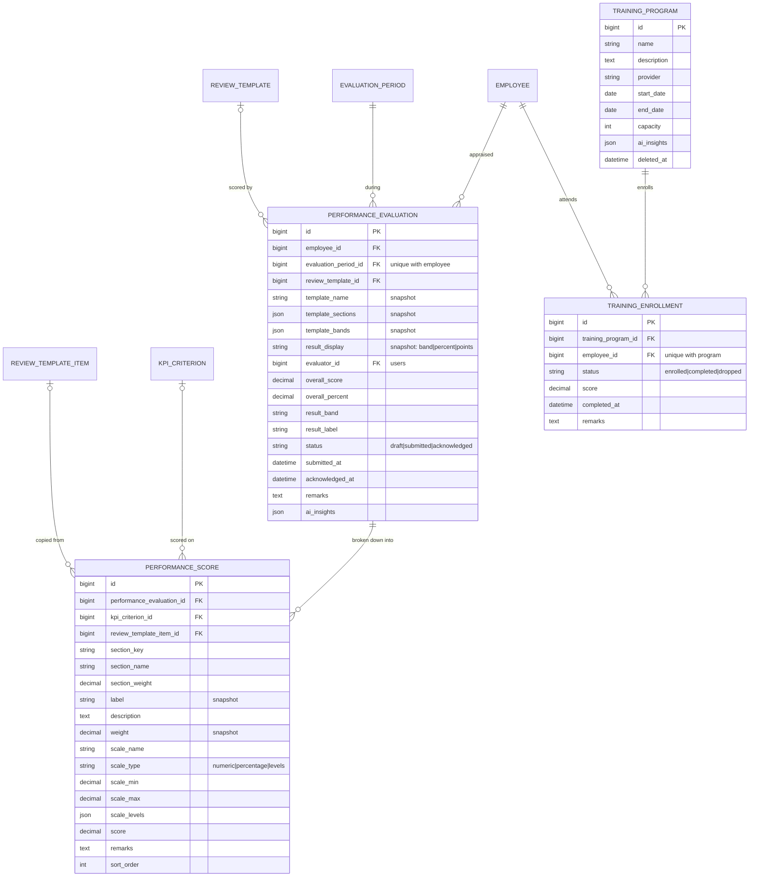
```mermaid
erDiagram
    EMPLOYEE ||--o{ PERFORMANCE_EVALUATION : appraised
    EVALUATION_PERIOD ||--o{ PERFORMANCE_EVALUATION : "during"
    REVIEW_TEMPLATE |o--o{ PERFORMANCE_EVALUATION : "scored by"
    PERFORMANCE_EVALUATION ||--o{ PERFORMANCE_SCORE : "broken down into"
    KPI_CRITERION |o--o{ PERFORMANCE_SCORE : "scored on"
    REVIEW_TEMPLATE_ITEM |o--o{ PERFORMANCE_SCORE : "copied from"
    TRAINING_PROGRAM ||--o{ TRAINING_ENROLLMENT : enrolls
    EMPLOYEE ||--o{ TRAINING_ENROLLMENT : attends

    PERFORMANCE_EVALUATION {
        bigint id PK
        bigint employee_id FK
        bigint evaluation_period_id FK "unique with employee"
        bigint review_template_id FK
        string template_name "snapshot"
        json template_sections "snapshot"
        json template_bands "snapshot"
        string result_display "snapshot: band|percent|points"
        bigint evaluator_id FK "users"
        decimal overall_score
        decimal overall_percent
        string result_band
        string result_label
        string status "draft|submitted|acknowledged"
        datetime submitted_at
        datetime acknowledged_at
        text remarks
        json ai_insights
    }
    PERFORMANCE_SCORE {
        bigint id PK
        bigint performance_evaluation_id FK
        bigint kpi_criterion_id FK
        bigint review_template_item_id FK
        string section_key
        string section_name
        decimal section_weight
        string label "snapshot"
        text description
        decimal weight "snapshot"
        string scale_name
        string scale_type "numeric|percentage|levels"
        decimal scale_min
        decimal scale_max
        json scale_levels
        decimal score
        text remarks
        int sort_order
    }
    TRAINING_PROGRAM {
        bigint id PK
        string name
        text description
        string provider
        date start_date
        date end_date
        int capacity
        json ai_insights
        datetime deleted_at
    }
    TRAINING_ENROLLMENT {
        bigint id PK
        bigint training_program_id FK
        bigint employee_id FK "unique with program"
        string status "enrolled|completed|dropped"
        decimal score
        datetime completed_at
        text remarks
    }
```

---

## 9. Awards & events

See [awards tables](./awards-tables.md), [events tables](./events-tables.md),
[ADR 0014](../decisions/0014-awards-and-recognition.md) and
[ADR 0015](../decisions/0015-events-and-meetings.md).

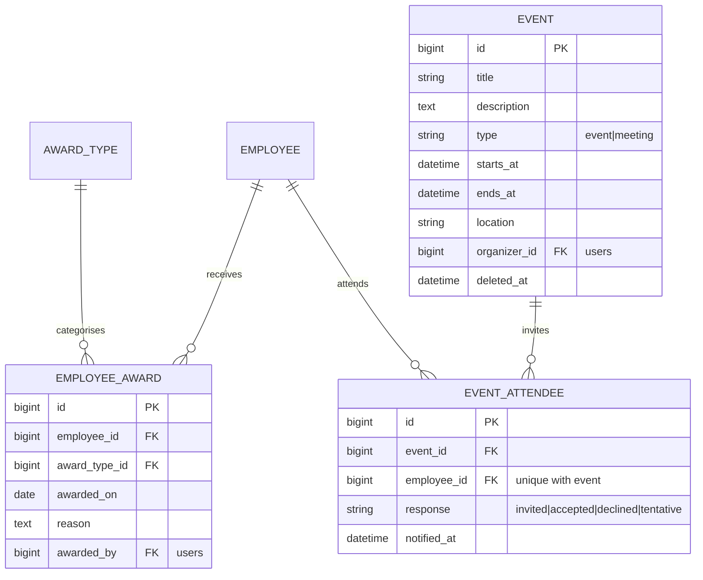
```mermaid
erDiagram
    EMPLOYEE ||--o{ EMPLOYEE_AWARD : receives
    AWARD_TYPE ||--o{ EMPLOYEE_AWARD : categorises
    EVENT ||--o{ EVENT_ATTENDEE : invites
    EMPLOYEE ||--o{ EVENT_ATTENDEE : attends

    EMPLOYEE_AWARD {
        bigint id PK
        bigint employee_id FK
        bigint award_type_id FK
        date awarded_on
        text reason
        bigint awarded_by FK "users"
    }
    EVENT {
        bigint id PK
        string title
        text description
        string type "event|meeting"
        datetime starts_at
        datetime ends_at
        string location
        bigint organizer_id FK "users"
        datetime deleted_at
    }
    EVENT_ATTENDEE {
        bigint id PK
        bigint event_id FK
        bigint employee_id FK "unique with event"
        string response "invited|accepted|declined|tentative"
        datetime notified_at
    }
```

---

## 10. Predictive analytics

Three surfaces on one inference service, each a run header plus a line per employee
(unique per run). Every run says which model scored it: `model_version`, and
`local_model_id` when it was the organisation's own model. See
[promotion readiness](./promotion-readiness-tables.md),
[performance forecast](./performance-forecast-tables.md),
[attrition risk](./attrition-risk-tables.md) and
[model graduation](./model-graduation-tables.md) tables.

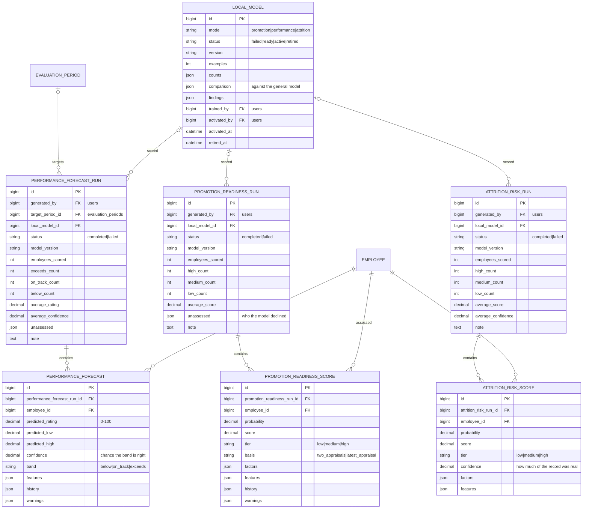
```mermaid
erDiagram
    PROMOTION_READINESS_RUN ||--o{ PROMOTION_READINESS_SCORE : contains
    PERFORMANCE_FORECAST_RUN ||--o{ PERFORMANCE_FORECAST : contains
    ATTRITION_RISK_RUN ||--o{ ATTRITION_RISK_SCORE : contains
    EMPLOYEE ||--o{ PROMOTION_READINESS_SCORE : assessed
    EMPLOYEE ||--o{ PERFORMANCE_FORECAST : forecast
    EMPLOYEE ||--o{ ATTRITION_RISK_SCORE : scored
    EVALUATION_PERIOD |o--o{ PERFORMANCE_FORECAST_RUN : targets
    LOCAL_MODEL |o--o{ PROMOTION_READINESS_RUN : scored
    LOCAL_MODEL |o--o{ PERFORMANCE_FORECAST_RUN : scored
    LOCAL_MODEL |o--o{ ATTRITION_RISK_RUN : scored

    PROMOTION_READINESS_RUN {
        bigint id PK
        bigint generated_by FK "users"
        bigint local_model_id FK
        string status "completed|failed"
        string model_version
        int employees_scored
        int high_count
        int medium_count
        int low_count
        decimal average_score
        json unassessed "who the model declined"
        text note
    }
    PROMOTION_READINESS_SCORE {
        bigint id PK
        bigint promotion_readiness_run_id FK
        bigint employee_id FK
        decimal probability
        decimal score
        string tier "low|medium|high"
        string basis "two_appraisals|latest_appraisal"
        json factors
        json features
        json history
        json warnings
    }
    PERFORMANCE_FORECAST_RUN {
        bigint id PK
        bigint generated_by FK "users"
        bigint target_period_id FK "evaluation_periods"
        bigint local_model_id FK
        string status "completed|failed"
        string model_version
        int employees_scored
        int exceeds_count
        int on_track_count
        int below_count
        decimal average_rating
        decimal average_confidence
        json unassessed
        text note
    }
    PERFORMANCE_FORECAST {
        bigint id PK
        bigint performance_forecast_run_id FK
        bigint employee_id FK
        decimal predicted_rating "0-100"
        decimal predicted_low
        decimal predicted_high
        decimal confidence "chance the band is right"
        string band "below|on_track|exceeds"
        json features
        json history
        json warnings
    }
    ATTRITION_RISK_RUN {
        bigint id PK
        bigint generated_by FK "users"
        bigint local_model_id FK
        string status "completed|failed"
        string model_version
        int employees_scored
        int high_count
        int medium_count
        int low_count
        decimal average_score
        decimal average_confidence
        text note
    }
    ATTRITION_RISK_SCORE {
        bigint id PK
        bigint attrition_risk_run_id FK
        bigint employee_id FK
        decimal probability
        decimal score
        string tier "low|medium|high"
        decimal confidence "how much of the record was real"
        json factors
        json features
    }
    LOCAL_MODEL {
        bigint id PK
        string model "promotion|performance|attrition"
        string status "failed|ready|active|retired"
        string version
        int examples
        json counts
        json comparison "against the general model"
        json findings
        bigint trained_by FK "users"
        bigint activated_by FK "users"
        datetime activated_at
        datetime retired_at
    }
```

> The trained model files themselves are not in the database. The reference models
> ship with the inference service (`model/artifacts/<surface>/`). An organisation's
> own models are written by the service to `model/artifacts/local/<tenant>/…`, and a
> `local_models` row points at them by version. See
> [Deployment](../deployment.md) for what that means in a container.

---

## 11. Assistant

Conversation history for the floating assistant. Each thread belongs to one user in
one organisation. See [assistant tables](./assistant-tables.md) and the
[Assistant](../modules/assistant.md) module doc.

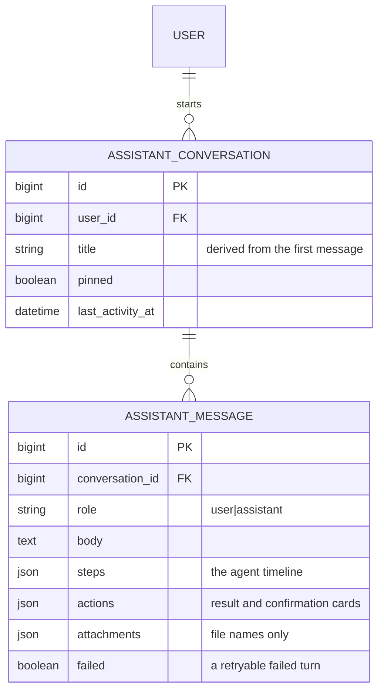
```mermaid
erDiagram
    USER ||--o{ ASSISTANT_CONVERSATION : starts
    ASSISTANT_CONVERSATION ||--o{ ASSISTANT_MESSAGE : contains

    ASSISTANT_CONVERSATION {
        bigint id PK
        bigint user_id FK
        string title "derived from the first message"
        boolean pinned
        datetime last_activity_at
    }
    ASSISTANT_MESSAGE {
        bigint id PK
        bigint conversation_id FK
        string role "user|assistant"
        text body
        json steps "the agent timeline"
        json actions "result and confirmation cards"
        json attachments "file names only"
        boolean failed "a retryable failed turn"
    }
```

> The assistant has **no action tables**. Its tools call the same support classes as
> the screens, so every write lands in that module's own tables and in
> `activity_logs`. An attached document is read inline for the turn and not stored;
> only its file name is kept. A write held for the user's confirmation lives in the
> cache for 15 minutes, not in a table.

---

## 12. Framework tables

Laravel's own plumbing, not drawn: `cache`, `cache_locks`, `jobs`, `job_batches`,
`failed_jobs`, `sessions`, `password_reset_tokens` and `migrations`. Sessions, the
cache and the queue all use the database in the shipped configuration.

---

## Central relationships at a glance

- **`EMPLOYEE`** is the hub. It belongs to a department, a position, a manager (self)
  and, through the resolver, a schedule. It is referenced by attendance, leave,
  performance, training, awards, events, onboarding, offboarding, promotions,
  certifications, documents and all three prediction tables.
- **`USER`** is the actor. It owns sign-in, memberships, roles, the audit trail,
  notifications and assistant conversations, and is the FK of every actor column.
  It is an employee of each organisation through at most one `EMPLOYEE` row.
- **`ORGANIZATION`** owns everything else through `organization_id`.
- **Company Setup** rows are the lookups the operational modules depend on.

---

## What the draft proposed

The first version of this file was a proposal written before the modules existed.
These parts of it did not become tables:

| Draft entity | What happened |
| --- | --- |
| `COMPANY_PROFILE` | It is the `organizations` row ([ADR 0005](../decisions/0005-multi-tenancy.md)). |
| `BACKUP` | Never built. *Data Backup & Export* is a sidebar entry with no screen behind it. |
| `EMAIL_TEMPLATE` | Never built. Notification mail is rendered from code. |
| `ATTENDANCE` + `ATTENDANCE_IMPORT_BATCH` | Built instead as `attendance_records` + `attendance_punches`, with schedules, assignments, the roster and policies (§6). There is no bulk import. Device ingestion was built and then removed ([ADR 0054](../decisions/0054-no-kiosks-or-biometric-scanners.md)), as were attendance requests and periods ([ADR 0042](../decisions/0042-no-attendance-requests-or-periods-the-roster-is-setup.md)). |
| Payroll & Benefits (`PAYROLL_PERIOD`, `PAYSLIP*`, `ALLOWANCE_TYPE`, `DEDUCTION_TYPE`, `EMPLOYEE_ALLOWANCE`, `EMPLOYEE_DEDUCTION`, `BENEFIT_*`) | Built, then removed ([ADR 0019](../decisions/0019-remove-payroll-and-benefits.md)). |
| `ML_MODEL` | Replaced by a `model_version` string on each run, plus `local_models` for an organisation's own models (§10). |
| `ATTRITION_PREDICTION`, `PROMOTION_READINESS` | Built as run + score pairs (§10). |
| `GENERATED_REPORT` | Not needed: reports are computed on demand and exported straight to the browser ([Reports](../modules/reports.md)). |
| `DOCUMENT_EXTRACTION` | Not needed: a document attached to the assistant is read inline for that turn (§11). |

## Remaining questions

1. **`users.employee_id`.** The free-text label predates `employees.employee_no` and is
   still unique and editable on the account, but nothing reads it as a link. Drop it,
   or keep it as a display label?

## Keeping this current

When a migration adds or changes a table, update the table's schema doc and the
matching section here in the same change. To check this file against the code:

```bash
createdb synapse_erd
DB_DATABASE=synapse_erd php artisan migrate --force
psql -d synapse_erd -c "select table_name, column_name, data_type, is_nullable
  from information_schema.columns where table_schema = 'public'
  order by table_name, ordinal_position"
dropdb synapse_erd
```
